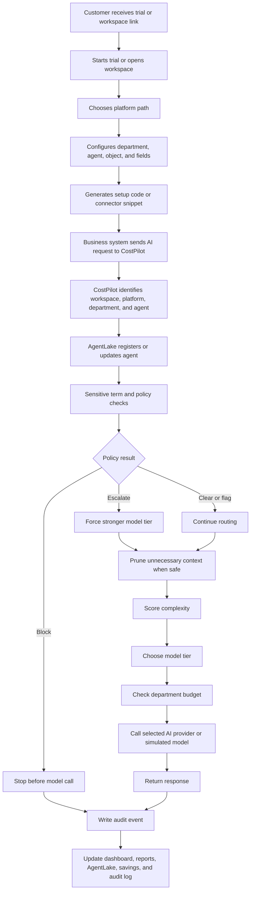

# CostPilot Full Functionality Guide

This document explains what CostPilot does, how the pieces fit together, what a customer sees, what happens behind the scenes, and what the current product can and cannot do.

It is written for business partners, pilot customers, executives, and semi-technical readers. It avoids unnecessary code detail, but it is grounded in the current CostPilot application structure.

CostPilot is not an AI model. CostPilot is an AI control layer. It sits between business systems and AI providers so requests can be governed, routed, pruned, budgeted, audited, and reported.

---

## Chapter 1: Executive Summary

CostPilot helps organizations manage AI usage across platforms such as Salesforce, ServiceNow, HubSpot, Zendesk, custom applications, and direct API workflows.

The core idea is simple:

Instead of every department, workflow, or AI agent sending requests directly to an expensive model, CostPilot receives the request first and decides what should happen.

CostPilot can:

- Identify which platform, agent, and department sent a request.
- Remove unnecessary text before the request is sent to AI.
- Detect sensitive terms and risky content.
- Block requests before they reach an AI model.
- Escalate important requests to a stronger model tier.
- Route routine requests to cheaper model tiers.
- Track department spend against monthly budget caps.
- Register and monitor AI agents in AgentLake.
- Record decisions in an audit log.
- Show savings, governance, risk, and usage reports.
- Help a new customer start a 30-day trial and test the product quickly.

CostPilot cannot:

- Govern AI requests that do not pass through CostPilot.
- Guarantee that every sensitive term or risk is detected without configuration.
- Replace legal, compliance, security, or AI governance teams.
- Guarantee the correctness of an AI response.
- Magically know future model prices unless those prices are updated in the model registry or a pricing update process is added.

---

## Chapter 2: The Big Picture Flow

This is the main product flow.



Think of CostPilot like an airport control tower for AI traffic.

The business system is the airplane. The AI provider is the destination. CostPilot decides whether the plane is safe to fly, which route it should take, which runway it should use, and how the trip should be logged.

---

## Chapter 3: Customer Trial And New Customer Journey

The intended new-customer path is:

1. Customer receives a link.
2. Customer starts a 30-day trial.
3. Customer opens the workspace command center.
4. Customer chooses a platform.
5. Customer configures fields, department, and agent name.
6. Customer generates setup code.
7. Customer sends the first test request.
8. Customer sees activity in the dashboard and reports.
9. Customer can request an upgrade.

### What The Customer Sees

The customer sees pages such as:

- `trial.html`: start or access a trial.
- `workspace.html`: command center for setup, testing, dashboard access, and upgrade path.
- `onboarding.html`: setup flow for platform, fields, agents, and generated code.
- `index.html`: executive dashboard.
- `operate.html`: operational dashboard with AgentLake, budget controls, audit stream, and live activity.
- `reports.html`: reporting views.
- `upgrade.html`: upgrade request path.

### What Happens Behind The Scenes

The backend creates or reads a `TrialAccount` record. That record can track:

- Email
- Name
- Company
- Provider
- Workspace ID
- Secret key
- Platform
- Trial start and end date
- Plan
- Upgrade request
- Usage caps
- Whether setup is complete

Trial usage is separated by workspace ID. Workspace-tagged activity is stored using department prefixes such as:

`WORKSPACE_ID:DepartmentName`

The UI now strips the workspace prefix for display so users see `Marketing` instead of a long internal ID.

### Current Boundary

The trial flow exists and supports workspace identity and usage limits. A production launch still needs stronger account management, payment/subscription management, customer support flows, and hardened tenant isolation.

---

## Chapter 4: Platform Setup And Generated Connectors

CostPilot is intended to be platform-flexible.

Supported setup paths currently include:

- Salesforce
- ServiceNow
- HubSpot
- Python
- Node.js
- Java
- Ruby
- REST/cURL
- Other/custom API workflows

### What The User Configures

During onboarding, the customer can define:

- Platform
- Object or record type
- Department
- Agent name
- Fields to send to AI
- Optional return fields
- Generated code path

For Salesforce, examples include:

- Object: `Case`
- Fields: `Subject`, `Description`, `Priority`, custom fields
- Agent name: `SF-CaseBot`
- Department: `Support`

For ServiceNow:

- Table: `Incident`
- Fields: `short_description`, `description`, `priority`, `assignment_group`
- Agent name: `SN-IncidentBot`
- Department: `IT`

For HubSpot:

- Object: `Ticket`, `Deal`, or similar
- Properties: subject/content/deal fields
- Agent name: `HubSpot-SalesBot`
- Department: `Sales`

### Why Agent Name And Department Matter

Agent name and department are not just labels. They drive:

- AgentLake identity
- Budget tracking
- Reports
- Audit logs
- Department-level savings
- Platform traceability

If a platform sends only a long internal ID instead of a friendly name, the UI becomes confusing. CostPilot now has display helpers to make workspace-prefixed departments readable, but the better long-term path is for connectors to send clear names.

### Current Boundary

Generated setup code is useful for pilots and demos. For AppExchange or enterprise deployment, the cleaner long-term design is a managed connector/package with configurable mappings, so customers can add fields and agents later without regenerating code every time.

---

## Chapter 5: Request Routing Engine

The routing engine is the heart of CostPilot.

It receives a text payload and decides which model tier should handle it.

### Routing Inputs

A request can include:

- Prompt text
- Department
- Agent name
- Source platform
- Workspace ID
- Whether pruning is enabled
- Optional tier override tags
- Sensitive terms or matched keywords

### Complexity Scoring

The current router checks:

- Estimated token count
- Complexity keywords
- Forced tier tags such as `[scout]`, `[analyst]`, `[advisor]`, `[strategist]`
- Sensitive-term escalation
- Department budget throttle state

The router classifies requests as:

- Routine
- Moderate
- Complex
- Throttled

### Tier Mapping

CostPilot uses four model tiers:

- Tier 1: Scout
- Tier 2: Analyst
- Tier 3: Advisor
- Tier 4: Strategist

Simple work should go to cheaper tiers. More complex or risky work can go to stronger tiers.

Example:

- “Password reset please” should usually route to Scout.
- “Summarize this renewal contract and identify legal risk” may route to Advisor.
- “Analyze a HIPAA breach and litigation exposure” may route to Strategist or be blocked/escalated depending on policy.

### Model Registry Lookup

After CostPilot selects a tier, it looks for an enabled model in the model registry.

Lookup priority:

1. Department-specific default model for the selected tier.
2. Department-specific enabled model for the selected tier.
3. Global default model for the selected tier.
4. Global enabled model for the selected tier.
5. Fallback/cascade logic if no model is available.

### Current Boundary

The routing logic exists and works for the current application. Production customers will need clear model setup, pricing maintenance, provider key strategy, and customer-specific governance rules.

---

## Chapter 6: Token Pruning

Token pruning removes unnecessary text before an AI request is sent.

The goal is not to change the meaning of the request. The goal is to remove waste.

### What The Pruner Targets

The current pruner can strip:

- HTML tags
- Inline style/script blocks
- Email headers
- Raw MIME header lines
- Reply chains
- Forwarded-message history
- Corporate signatures
- Legal disclaimer blocks
- Excess whitespace
- Common automated ticket-system boilerplate

### What It Protects

The pruner includes code detection logic. If the payload appears to be code, it can bypass pruning to avoid damaging syntax.

It looks for patterns like:

- Private key headers
- Shebang lines
- Markdown code fences
- Function/class definitions
- SQL statements
- Code punctuation density

### Why It Matters

AI providers charge based on tokens. If a Salesforce case description includes a long email chain, 80 percent of the content may be repeated headers, signatures, disclaimers, and old replies. CostPilot can strip that waste before the model call.

### Where Token Savings Show Up

Token savings are stored on `TokenTransaction`:

- `was_pruned`
- `tokens_saved`

They are shown in:

- Executive dashboard
- Governance event stream details
- Savings reports
- Reports summary cards
- Audit detail panels where available

### Current Boundary

Token counts are estimated using a character-based heuristic in some places. For exact billing-grade accounting, provider usage responses and tokenizer-specific counting would be stronger.

---

## Chapter 7: Sensitive Terms, Risk Policies, And Blocking

CostPilot has a sensitive term library.

Each term can have:

- Term text
- Category
- Action
- Optional department scope

Actions include:

- `flag`
- `escalate`
- `block`

### Flag

A flagged request is allowed to continue, but it is marked in the audit log.

Example:

The word “audit” may be logged for compliance review.

### Escalate

An escalated request is forced toward a stronger tier.

Example:

The word “legal” can force a request to Advisor or higher depending on routing rules.

### Block

A blocked request stops before it reaches any AI model.

Example:

If a payload includes a blocked sensitive term or detected sensitive data, the request can be rejected and logged.

### Current Boundary

Sensitive term matching is only as good as the configured term library and detection logic. It is not a full replacement for enterprise DLP tooling.

---

## Chapter 8: Budget Governance

CostPilot tracks AI spend by department.

Each department budget can store:

- Monthly cap
- Current spend
- Period start
- Throttle state
- Override state
- Throttle tier
- Raw payload logging setting
- Raw payload retention period

### Budget Cap

A department can have a monthly cap such as:

- Support: `$1,000`
- Sales: `$500`
- Marketing: `$250`

### Throttling

If a department reaches its cap, CostPilot can throttle it.

Throttling means future requests are capped to a cheaper tier unless an override is granted.

Example:

Marketing hits its monthly cap. CostPilot caps future Marketing calls at Scout until the budget period resets or an override is granted.

### Override

An override allows a department to keep routing above the throttle tier after hitting its cap.

### Raw Payload Logging

Raw payload logging can be enabled per department.

This is useful for debugging, but it is sensitive because it can store pre-pruned content. The current system supports retention settings, but production use should be reviewed carefully by security/legal teams.

### Current Boundary

Budget tracking is functional for the app. Production billing and enterprise finance workflows would need stronger reconciliation, tenant controls, provider billing alignment, and possibly invoice integration.

---

## Chapter 9: AgentLake Registry

AgentLake is CostPilot’s registry of AI digital workers.

It answers:

- Which agents exist?
- Which platform did they come from?
- Which department owns them?
- Are they idle, active, locked, or queued?
- When were they last used?
- What model tiers are they allowed to use?
- Is pruning enabled for them?

### Agent Record

An agent can store:

- Name
- Department
- Source platform
- Permissions
- Target table
- Target record ID
- Status
- Collision policy
- Last used timestamp
- Archive state
- Minimum tier
- Maximum tier
- Pruning enabled flag

### Auto Registration

When a request comes through the trial proxy or platform flow, CostPilot can auto-register an agent if it has not seen that agent before.

Example:

Salesforce sends a request with:

- Agent name: `SF-CaseBot`
- Department: `Support`
- Platform: `Salesforce`

CostPilot creates or updates the AgentLake entry.

### Active / Idle Status

Agent cards can show active briefly after a request. This helps users see which agents are currently processing or recently processed requests.

### Archive

Agents can be archived instead of deleted. This hides them from the live view while preserving history.

### Current Boundary

Agent identity depends on good metadata from the connector. If a connector sends long IDs instead of friendly names, the UI becomes harder to understand. The long-term product should make naming agents easy during onboarding and editable later.

---

## Chapter 10: Collision Control

AgentLake includes a “traffic cop” concept.

The purpose is to prevent multiple AI agents from writing to the same record at the same time without visibility.

### Example

Two support bots try to update the same customer case:

- `SupportBot-Alpha`
- `SupportBot-Beta`

CostPilot can detect a collision and lock or flag the conflict based on policy.

### Collision Policies

Current policy concepts include:

- Lock
- Queue
- Skip

### Why It Matters

AI agents are not just chatbots. They may write fields, update tickets, draft responses, or change CRM records. If multiple agents work on the same record at once, the company needs controls.

### Current Boundary

The collision feature is represented in the data model and UI. Production use would require carefully integrated write-back behavior in each platform connector.

---

## Chapter 11: Audit Log And Governance Event Stream

CostPilot records high-stakes decisions in an audit log.

Audit events can include:

- Event type
- Agent ID
- Department
- Model tier
- Context snapshot
- Prompt payload
- Raw payload when enabled
- Matched keywords
- Rationale
- Decision outcome
- Risk level
- Timestamp

### Event Types

Examples include:

- Routing
- Throttle
- Lock
- Decision
- Blocked request

### Governance Event Stream

The dashboard includes a live stream of governance events.

Users can see:

- Request outcome
- Agent
- Department
- Risk level
- Model tier
- Budget context
- Matched keywords
- Prompt preview
- Token pruning details where available
- Download link for JSONL audit file

### Why It Matters

Executives and compliance teams need to know not just that AI was used, but why a request was allowed, blocked, escalated, or routed to a certain tier.

### Current Boundary

Audit events are useful for pilot visibility. Production-grade audit requirements may require tamper resistance, retention policies, customer-specific data residency, access control, and SIEM/export integration.

---

## Chapter 12: Executive Dashboard

The executive dashboard is designed to answer:

- Is CostPilot saving money?
- How many AI requests are governed?
- Are departments staying under budget?
- Which routing tiers are being used?
- Are there compliance events?
- Which agents are active?

### Key Dashboard Areas

The dashboard can show:

- Total AI spend avoided
- Economy routing percentage
- Requests governed
- Context pruning savings
- Projected annual savings
- Department health
- AgentLake live status
- Budget utilization
- Governance event stream
- Agent efficiency rank
- 30-day spend and activity trends
- Routing insights
- Blocked-event banner

### Filters

The main page includes executive filters such as:

- Department
- Platform
- Agent
- Time range
- Tier
- Risk

These help the user narrow the view.

### Current Boundary

The dashboard is strong for demos and pilots. Production dashboard work should continue around multi-tenant access, clearer empty states, stable filter persistence, and customer-specific role views.

---

## Chapter 13: Reports

The reports page provides multiple reporting modules.

### Savings Report

Shows:

- Actual AI cost
- Hypothetical all-flagship baseline
- Savings
- Model split
- Token pruning savings
- Downgrade savings

### Risk And Compliance Report

Shows:

- Total audit events
- Critical events
- High-risk events
- Blocked requests
- Agent collisions
- Term library counts
- Daily risk events
- Risk level breakdown
- Governance and compliance activity
- Executive summary of AI governance ROI
- Recent high-stakes event table

Recent high-stakes events now have filters:

- Department
- Risk
- Event type
- Search

### Department Report

Shows:

- Department scorecard
- Daily spend by department
- Cost by department
- Budget used percentage
- Throttle/override status

The department charts now preserve legend filtering across auto-refresh.

### Bot Efficiency Review

Analyzes agent performance and shows:

- Agent grade
- Calls
- Cost
- Average cost per call
- Economy percentage
- Tokens pruned
- Findings and recommendations

### Agent Activity Report

Shows:

- Platform
- Agent
- Department
- Model tier
- Cost
- Call log
- Filters for platform, agent, department, and tier

### ROI Calculator

Helps estimate potential savings and risk value for business discussions.

### Current Boundary

Reports depend on available transaction and audit data. If a pilot has little traffic, the reports will look sparse until test or real requests are routed.

---

## Chapter 14: Model Registry And Pricing

CostPilot uses a model registry to understand model tiers and prices.

### Model Registry Stores

- Display name
- Model ID
- Provider
- Tier
- Input cost per 1 million tokens
- Output cost per 1 million tokens
- Enabled/disabled state
- Default state
- Optional department scope
- Notes

### Known Models

The known model list supports a preset dropdown so admins can add models more easily.

### How CostPilot Calculates Cost

At a high level:

```text
input_cost = input_tokens * input_price_per_token
output_cost = output_tokens * output_price_per_token
total_cost = input_cost + output_cost
```

Because model prices are stored as dollars per 1 million tokens:

```text
input_price_per_token = cost_input_per_1m / 1,000,000
output_price_per_token = cost_output_per_1m / 1,000,000
```

### How Savings Are Calculated

Savings are estimated by comparing actual routing against a more expensive baseline.

Examples:

- If a request used Scout but would otherwise have used Advisor, the difference is downgrade savings.
- If the pruner stripped tokens before the model call, those removed tokens are pruning savings.
- If a request was blocked before reaching a model, CostPilot can count avoided model spend for that blocked request.

### Current Gap

Model prices change. Today, the registry stores prices, but humans still need to keep them current unless an automated provider-pricing update process is added.

Recommended long-term improvement:

- Keep current manual admin editing.
- Add known-model pricing update workflow.
- Store price effective dates.
- Warn admins when model pricing is stale.
- Eventually add provider pricing sync where reliable.

---

## Chapter 15: Customer Proxy And API Key Strategy

CostPilot includes OpenAI-compatible and Anthropic-compatible proxy routes.

Examples:

- `/v1/ws-{workspace_id}/chat/completions`
- `/v1/ws-{workspace_id}/messages`

### Proxy Flow

The proxy can:

1. Validate workspace ID and `X-CostPilot-Key`.
2. Check whether the trial is active.
3. Enforce usage limits.
4. Prune user message content.
5. Check sensitive terms.
6. Route the request.
7. Forward the request to the provider.
8. Log the transaction.
9. Auto-register the agent.
10. Return the provider response plus CostPilot metadata.

### Managed Provider Key Concept

The code supports the idea that CostPilot can own the provider key during a trial. This helps customers avoid pasting their own AI API keys during early evaluation.

The system also includes a field for customer provider key storage on the trial account. In production, key handling should be designed carefully.

### Security Note

The current model includes base64-encoded key storage for trial accounts. Base64 is not encryption. Production key storage should use proper encryption and secret management.

### Current Boundary

For private pilot, CostPilot-managed keys can simplify onboarding. For enterprise production, customers may prefer their own provider account, a managed CostPilot account, or a bring-your-own-key option with secure storage.

---

## Chapter 16: Voice Guard

CostPilot includes a Voice Guard module concept for voice transcripts.

Voice events can track:

- Call ID
- Platform
- Department
- Raw transcript
- Clean transcript
- Redaction count
- PII types found
- Detection method
- Confidence score
- Flagged-for-review state
- Processing time
- Detection details

### Use Case

A support call transcript contains sensitive information. Voice Guard can redact or flag it before it is used in AI workflows.

### Current Boundary

Voice Guard exists in the backend and UI structure. Production voice integrations would require specific telephony/contact-center connectors and stronger security review.

---

## Chapter 17: Admin And Operations

The admin/operate experience is where supervisors manage the system.

### Admin Functions

Admin and operations pages can include:

- Department budgets
- AgentLake registry
- Agent archiving
- Tier bounds
- Pruner toggle
- Raw payload logging toggle
- Sensitive keywords
- Routing rules
- Model registry
- Known models
- Demo data controls

### Operational Questions Answered

- Which departments are over budget?
- Which agents are active?
- Which agents are archived?
- Are any agents locked?
- Are sensitive terms configured?
- Are model tiers configured?
- Are requests being routed to the expected tier?

### Current Boundary

Admin controls are powerful. Production will need stronger authentication, role-based access, audit tracking for admin changes, and customer-specific separation.

---

## Chapter 18: Data Model

CostPilot stores several categories of data.

### Operational Data

- Customers
- Tickets
- CRM records
- Registered agents
- Department budgets

### AI Usage Data

- Token transactions
- Model tier used
- Input tokens
- Output tokens
- Cost
- Source platform
- Department
- Agent link
- Routing reason
- Pruning result

### Governance Data

- Audit events
- Risk level
- Decision outcome
- Rationale
- Matched keywords
- Raw payload when enabled
- Prompt payload

### Configuration Data

- Model registry
- Known models
- Sensitive terms
- Routing config
- Trial accounts

### Current Boundary

The current database is a shared application database. Workspace IDs are used to separate trial data. For production customers, the company should decide whether to use:

- Shared multi-tenant database with strict tenant isolation
- Separate database per enterprise customer
- Separate schema per enterprise customer
- Hybrid model

This decision affects security, cost, compliance, and support.

---

## Chapter 19: Security And Compliance Considerations

Security is one of the most important production topics.

### Current Helpful Controls

CostPilot already includes concepts for:

- Workspace ID separation
- Secret key validation for proxy calls
- Sensitive term blocking
- Audit logs
- Raw payload logging controls
- Department-level raw retention settings
- Agent identity
- Request metadata
- Block-before-model behavior

### Production Hardening Needed

Before broad customer launch, the product should improve:

- Authentication
- Role-based access control
- Tenant isolation
- Secret encryption
- Key rotation
- Audit integrity
- Admin change logs
- Data retention policies
- Data deletion workflows
- Error handling
- Rate limiting
- Abuse prevention
- Secure customer onboarding
- Security documentation

### Plain-English Example

Today, CostPilot is like a working control room with cameras, switches, and logs. Before inviting large enterprise customers, it needs badge access, locked cabinets, tamper-proof logs, and clear operating procedures.

---

## Chapter 20: Environments And Pages

There are multiple pages and environments, which can feel confusing.

### Main App

Primary Heroku app:

`https://fage-engine-21cb49fe4806.herokuapp.com/`

Common pages:

- `/index.html`
- `/operate.html`
- `/workspace.html`
- `/trial.html`
- `/onboarding.html`
- `/reports.html`
- `/models.html`
- `/policy.html`
- `/upgrade.html`
- `/savings.html`
- `/live-landing.html`

### Demo App

Demo Heroku app:

`https://costpilot-demo-cd9ac9dca0f6.herokuapp.com/`

This is used for enterprise demo data and customer-safe demonstration flows.

### Recommended Organization

Use three mental buckets:

1. Customer starting point:
   - `trial.html`
   - `workspace.html`
   - `onboarding.html`

2. Daily product experience:
   - `index.html`
   - `operate.html`
   - `reports.html`
   - `models.html`
   - `policy.html`

3. Demo/sales collateral:
   - Demo app
   - `live-landing.html`
   - `demo-crm.html`
   - `savings.html`
   - `roi.html`

---

## Chapter 21: Real-Life Use Cases

### Use Case 1: Salesforce Agentforce Case Triage

A Salesforce Agentforce workflow wants to summarize a customer case.

Without CostPilot:

- The case text goes directly to one selected model.
- Long email threads may increase cost.
- Legal or sensitive terms may not be centrally governed.
- Reporting may be scattered.

With CostPilot:

1. Salesforce sends Case fields to CostPilot.
2. CostPilot identifies `SF-CaseBot`, `Support`, and `Salesforce`.
3. CostPilot strips email headers, signatures, and reply chains.
4. CostPilot checks for sensitive terms.
5. Routine cases route to Scout.
6. Legal cases can escalate to Advisor.
7. Blocked terms stop before the model.
8. The result is logged in audit and spend reports.

### Use Case 2: ServiceNow Incident Summary

An IT incident workflow sends `short_description`, `description`, priority, and assignment group.

CostPilot can:

- Route routine password issues to Scout.
- Escalate security breach language.
- Track spend to IT or Operations.
- Show the incident bot in AgentLake.

### Use Case 3: HubSpot Sales Email Review

A sales workflow wants to summarize a prospect email and recommend next steps.

CostPilot can:

- Remove old email chain content.
- Keep only the latest useful message.
- Route simple summaries to cheaper tiers.
- Escalate contract, NDA, or legal language.
- Track Sales department spend.

### Use Case 4: Marketing Budget Throttle

Marketing runs many AI content requests.

CostPilot can:

- Track Marketing spend.
- Show budget utilization.
- Throttle Marketing to Scout after cap is reached.
- Allow an override if leadership approves.

### Use Case 5: Compliance Block

A support request contains blocked sensitive data.

CostPilot can:

- Detect the configured sensitive term.
- Block the request before AI.
- Log an audit event.
- Show the blocked event in Risk & Compliance reports.

---

## Chapter 22: What Works Today

Current working MVP/private pilot capabilities include:

- Live application shell
- Trial/workspace flow
- Onboarding flow
- Multi-platform setup code generation
- Request routing
- Token pruning
- Sensitive term library
- Budget governance
- AgentLake registry
- Agent archive/hide behavior
- Audit log
- Governance event stream
- Executive dashboard
- Reports
- Model registry
- Known models
- Routing rules
- Test request flow
- Upgrade request flow
- Demo data loading
- Enterprise demo environment
- Department display-name cleanup
- Report filters
- Department chart filter preservation

---

## Chapter 23: What Needs More Work Before A Broad Launch

These are the main production-readiness gaps.

### Security

- Strong authentication
- Role-based access
- Proper secret encryption
- Tenant isolation
- Admin audit logs

### Customer Management

- Real signup/account ownership
- Subscription/payment integration
- Trial expiration emails
- Upgrade approval workflow
- Customer support process

### Connectors

- Managed Salesforce package
- Configurable mappings after install
- Easier agent naming
- Easier department mapping
- Return-field setup
- ServiceNow/HubSpot/Zendesk production connectors

### Pricing

- Model price update workflow
- Pricing effective dates
- Stale-price warnings
- Optional provider price sync

### Reliability

- Background jobs
- Retry handling
- Better error display
- Monitoring/alerts
- Test coverage

### Compliance

- Retention policies
- Data export
- Data deletion
- Audit immutability
- Customer-specific data handling docs

---

## Chapter 24: Plain-English Glossary

### Agent

An AI-powered workflow or digital worker, such as a Salesforce case bot or ServiceNow incident bot.

### AgentLake

The registry where CostPilot tracks AI agents, departments, platforms, status, and activity.

### Audit Event

A logged governance decision such as a block, escalation, routing decision, or collision.

### Department Budget

A monthly AI spend cap assigned to a business unit.

### Model Tier

A cost/strength category for AI models: Scout, Analyst, Advisor, Strategist.

### Pruning

Removing unnecessary text before an AI call to reduce token usage and cost.

### Routing

Choosing which model tier should handle a request.

### Throttling

Restricting a department to a cheaper model tier when its budget is reached.

### Workspace

A trial/customer-specific identity used to separate activity and route proxy requests.

---

## Chapter 25: The Simplest Way To Explain CostPilot

CostPilot helps companies control AI usage before it gets expensive, risky, or hard to explain.

It watches every governed request, removes waste, checks policy, chooses the right model tier, tracks budget, records the decision, and shows executives what happened.

It is not the AI brain. It is the AI control system.

