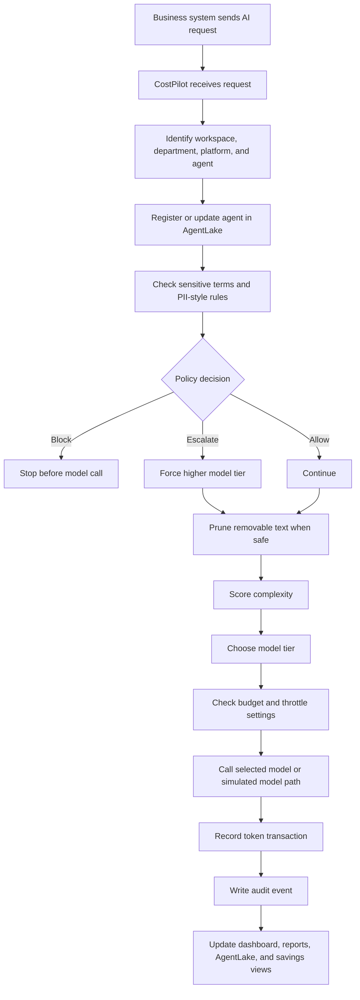
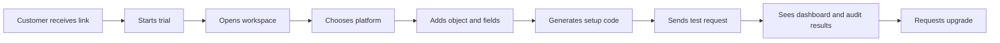

# CostPilot Backend, Database, and Security Podcast Resource

Use this document as a NotebookLM source for a podcast episode about how CostPilot works behind the scenes. It is written for a business audience that may include CEOs, CFOs, CTOs, operations leaders, and non-technical pilot users. The goal is to explain the product clearly without assuming deep software knowledge.

This document is based on the current CostPilot codebase. It avoids invented performance numbers or unsupported claims. Where the product is a prototype or MVP behavior, it says so plainly.

---

## 1. Simple Explanation

CostPilot is not an AI model.

CostPilot is a control layer that sits between business systems and AI providers. It helps a company decide how each AI request should be handled before that request reaches a model.

An easy analogy:

CostPilot is like an airport control tower for AI traffic.

The airplane is the AI request. Salesforce, ServiceNow, HubSpot, a custom app, or an API script is the airport gate where the request starts. The AI model is the destination. CostPilot sits in the tower and decides:

- Is this request allowed to take off?
- Is it carrying sensitive cargo?
- Which runway should it use?
- Should it go through a cheaper route or a premium route?
- Which department should pay for it?
- Should it be logged for audit review?
- Did the request include extra baggage that should be removed first?

CostPilot does not replace the business system or the AI provider. It governs the path between them.

---

## 2. Why CostPilot Exists

Companies are starting to connect AI into more workflows:

- Customer support case summaries
- Sales follow-up emails
- ServiceNow incident analysis
- HubSpot ticket routing
- Internal operations copilots
- Custom AI agents
- Voice transcript cleanup
- API-based automation

The problem is that AI usage can become hard to control.

Without a control layer, a company may not know:

- Which team sent the request
- Which AI agent made the call
- Which model was used
- Why a premium model was selected
- Whether sensitive data was sent
- How much the request cost
- Whether unnecessary email headers or reply chains inflated token usage
- Whether a department is about to exceed budget
- Whether the request should be reviewed later

CostPilot is meant to make that activity visible, governed, and easier to explain.

---

## 3. The Main Backend Flow

The backend is a FastAPI application. In plain language, FastAPI is the web service that receives requests from the browser, from customer platforms, and from generated integration code.

The CostPilot backend exposes routes such as:

- `/api/route` for routing one payload through CostPilot
- `/api/prune` for testing context pruning
- `/api/audit` for viewing audit events
- `/api/agents` for AgentLake registry data
- `/api/budget` for department budget controls
- `/api/models` for the model registry
- `/api/keywords` for sensitive terms
- `/api/reports` for reporting data
- `/api/trial` for trial signup and workspace status
- `/v1/ws-{workspace_id}/chat/completions` for OpenAI-compatible proxy calls
- `/v1/ws-{workspace_id}/messages` for Anthropic-compatible proxy calls

The normal flow looks like this:



The key idea:

CostPilot is not just sending text to AI. It is wrapping that AI call with governance, cost tracking, routing logic, and audit records.

---

## 4. The Request Journey in Plain English

Imagine a Salesforce Case is updated.

The Case has a subject and description. A Flow or generated Apex action sends that case text to CostPilot.

CostPilot then goes through several steps.

### Step 1: Identify the caller

CostPilot tries to identify:

- Workspace
- Platform
- Department
- Agent name
- Agent ID if available

Example:

- Platform: Salesforce
- Department: Support
- Agent: SF-CaseBot

Analogy:

This is like checking the caller ID before answering the phone.

### Step 2: Register the agent

If the agent does not already exist, CostPilot can create an AgentLake record.

AgentLake is the registry of AI workers. It tracks:

- Agent name
- Department
- Platform
- Status
- Last active time
- Tier bounds
- Whether pruning is enabled
- Archive status

Analogy:

AgentLake is like an employee badge system for AI workers. If a new digital worker shows up, CostPilot gives it a record so the company knows who is acting.

### Step 3: Check sensitive terms

CostPilot checks configured sensitive terms.

Sensitive terms can be configured to:

- Flag
- Escalate
- Block

Examples:

- "legal" can escalate the request to a higher model tier.
- "ssn" can block the request before it reaches an AI model.
- "credit card" can block the request.

Analogy:

This is like airport security scanning luggage before it gets loaded.

### Step 4: Prune unnecessary context

If pruning is enabled, CostPilot removes text that is usually not useful for the model.

The pruner can remove:

- HTML
- Email headers
- Reply chains
- Legal disclaimers
- Signatures
- Excess whitespace

It also records:

- Raw estimated token count
- Clean estimated token count
- Tokens saved
- Compression percentage
- Filters applied

Analogy:

This is like removing packing peanuts and old receipts before shipping a package. The useful item still ships, but the unnecessary weight is removed.

Important detail:

Code-like payloads can bypass pruning so CostPilot does not accidentally damage code, SQL, JSON, configuration, or technical syntax.

### Step 5: Score complexity

CostPilot looks at:

- Token length
- Complexity keywords
- Sensitive term escalation
- Explicit tier tags such as `[scout]`, `[analyst]`, `[advisor]`, or `[strategist]`

The routing logic maps work into tiers:

- Scout: routine, lower-cost work
- Analyst: moderate work
- Advisor: complex work
- Strategist: high-risk or forced premium work

Analogy:

This is like routing customer calls. A simple password reset does not need the senior specialist. A legal dispute or major outage might.

### Step 6: Choose a model from the model registry

CostPilot has a model registry.

The registry stores:

- Display name
- Provider
- Model ID
- Tier
- Input cost per million tokens
- Output cost per million tokens
- Enabled or disabled state
- Default model choice
- Optional department-specific model assignment

CostPilot uses the registry to decide which model belongs to each tier.

Analogy:

The model registry is like a menu of approved vendors and prices. CostPilot does not guess the price. It reads the configured price from the registry.

### Step 7: Check department budget

CostPilot tracks department budgets.

Each department can have:

- Monthly cap
- Current spend
- Throttle status
- Override status
- Throttle tier
- Raw payload logging setting
- Raw payload retention period

If a department hits its monthly cap, CostPilot can throttle future requests to a lower tier.

Analogy:

This is like a corporate credit card limit. If a team reaches its limit, future spending can be restricted unless a manager overrides it.

### Step 8: Call the model or simulated model path

CostPilot can operate in simulated or live model mode depending on configuration.

In simulated mode, CostPilot does not call a real AI provider. It estimates behavior and cost.

In live/proxy mode, CostPilot can forward requests to a provider path using configured provider credentials.

Important:

CostPilot itself is not the AI model. It is the router and control layer.

### Step 9: Record the transaction

CostPilot records the AI call in `token_transactions`.

This table is the financial source of truth for many dashboards.

It stores:

- Department
- Platform
- Agent
- Model tier
- Input tokens
- Output tokens
- Cost
- Timestamp
- Routing reason
- Whether pruning happened
- Tokens saved

Analogy:

This is the receipt for the AI call.

### Step 10: Write the audit event

CostPilot writes an audit event into `audit_events`.

An audit event can include:

- Event type
- Agent
- Department
- Model tier
- Context snapshot
- Prompt payload
- Raw payload if logging is enabled
- Matched keywords
- Rationale
- Decision outcome
- Risk level
- Timestamp

Analogy:

This is the black box recorder. If a leader asks, "Why did this request get routed this way?" the audit event is the answer.

---

## 5. Database Tables Explained

CostPilot uses SQLAlchemy models. SQLAlchemy is the layer that lets Python work with database tables.

The major tables are below.

### registered_agents

Purpose:

Tracks AI workers connected to CostPilot.

Plain-English example:

"Salesforce Case Bot from Support was last active at 2:45 PM and is currently idle."

Why it matters:

Leaders can see which AI agents exist and whether they are active, idle, locked, or archived.

### department_budgets

Purpose:

Tracks monthly AI spend by department.

Plain-English example:

"Support has a $200 monthly AI cap and has spent $42.15 so far."

Why it matters:

CFOs can see AI spend by team instead of only seeing one large provider bill.

### token_transactions

Purpose:

Records each AI call and its cost details.

Plain-English example:

"The Sales agent used Advisor tier, consumed 900 input tokens, 180 output tokens, and cost $0.004."

Why it matters:

This table powers savings, usage, reports, and efficiency metrics.

### audit_events

Purpose:

Records decisions and governance events.

Plain-English example:

"This request was routed to Advisor because it contained the word contract and exceeded the token threshold."

Why it matters:

This creates explainability. It helps answer why something happened, not just what happened.

### model_registry

Purpose:

Stores approved AI models, tier assignments, and prices.

Plain-English example:

"Claude Haiku is Scout tier. Claude Sonnet is Advisor tier. Claude Opus is Strategist tier."

Why it matters:

CostPilot needs model prices and tier assignments to estimate cost and savings.

### sensitive_terms

Purpose:

Stores customer-configured words or phrases that should trigger governance behavior.

Plain-English example:

"If a request contains 'ssn', block it. If it contains 'legal', escalate it."

Why it matters:

This lets a company create policy rules that match its risk profile.

### known_models

Purpose:

Stores known model presets that can appear in the model selector.

Plain-English example:

"These are the model options CostPilot knows about and can help admins select."

Why it matters:

It reduces setup friction, though the company still needs model pricing to stay accurate.

### routing_configs

Purpose:

Stores routing threshold and complexity keywords.

Plain-English example:

"If a request is longer than 250 tokens or includes certain complexity words, route it above Scout."

Why it matters:

Routing behavior can be tuned without changing code.

### trial_accounts

Purpose:

Stores pilot workspace information for 30-day trials.

Plain-English example:

"This workspace belongs to a trial customer, has a trial key, and has usage limits."

Why it matters:

This supports the plug-and-play trial concept.

### voice_events

Purpose:

Stores voice transcript processing results.

Plain-English example:

"A call transcript had three redactions and was flagged for review."

Why it matters:

Voice AI and call center AI often contain sensitive data. Voice Guard is meant to help catch and redact it.

---

## 6. Security and Governance View

CostPilot has several security-relevant behaviors in the current code.

### Sensitive term blocking

If a sensitive term is configured to block, CostPilot can stop the request before it reaches the AI model.

Example:

A support case includes "ssn." The request can be blocked before being sent to a provider.

Business meaning:

This reduces the chance that obvious sensitive data is sent to an AI model.

### Sensitive term escalation

If a term is configured to escalate, CostPilot can force the request to a stronger tier.

Example:

A case mentions "legal." CostPilot can route it to a higher tier because the business risk is higher.

Business meaning:

The company can choose to spend more only when the risk or complexity justifies it.

### Raw payload logging controls

CostPilot can store raw pre-pruned payloads only when raw payload logging is enabled for a department.

Department budgets include:

- `raw_payload_logging_enabled`
- `raw_retention_days`

Business meaning:

Some companies may want raw payload evidence for audit. Others may prefer not to store raw text unless necessary.

### Audit trail

CostPilot writes audit events and also has a JSONL audit export path.

Business meaning:

Executives and compliance teams can review a record of decisions.

### Content Security Policy

The backend sets a Content Security Policy header for browser pages.

Business meaning:

This is a browser security control that restricts where scripts, styles, images, fonts, and API connections can load from.

### CORS setting

The current backend allows all origins in CORS.

Business meaning:

This is flexible for demos and pilots, but a production hardening step would be to restrict allowed origins to approved domains.

### Trial key and proxy path

The trial proxy uses workspace IDs and CostPilot keys. Customers can route calls through a CostPilot-compatible API endpoint.

Business meaning:

The long-term product idea is that customers should not have to paste provider API keys casually into the UI. CostPilot can manage a proxy path where the customer integration talks to CostPilot, and CostPilot handles the provider route.

Important production note:

Before broad commercial launch, credential storage, tenant isolation, domain restrictions, logging controls, and secret management should be reviewed carefully.

---

## 7. What "No AI" Means

When explaining CostPilot, the phrase "there is no AI" can be confusing. A clearer version is:

CostPilot is not itself the AI brain. It is the traffic controller, budget guard, policy checker, and recorder around AI activity.

It can call a model path when configured, but CostPilot's main value is not generating the answer. Its value is deciding, controlling, tracking, and explaining the AI request.

Analogy:

A payment gateway is not the bank. It controls the transaction path, checks rules, and records what happened. CostPilot plays a similar role for AI requests.

---

## 8. Model Tiers Explained

Many people use ChatGPT by choosing one model in the interface. A company using APIs can have multiple models available behind the scenes.

CostPilot organizes those models into tiers:

- Scout: lowest-cost routine work
- Analyst: moderate work
- Advisor: complex work
- Strategist: highest-risk or highest-value work

Example:

A company might configure:

- Scout = fast, low-cost model for simple summaries
- Advisor = stronger model for legal, compliance, or complex reasoning
- Strategist = premium model for sensitive executive-level decisions

CostPilot decides which tier to use based on rules.

Analogy:

Think of a law firm. Not every task needs the senior partner. Some work can be done by an associate, some by a specialist, and some needs the senior partner. CostPilot applies that idea to AI model usage.

---

## 9. How CostPilot Knows the Price

CostPilot does not magically know every provider's current price.

The model registry stores the configured price for each model:

- Input cost per 1 million tokens
- Output cost per 1 million tokens

When a request is processed, CostPilot uses:

- Input token count
- Output token count
- Registry price for the selected model

Then it calculates the estimated cost.

Analogy:

If a shipping system knows the package weight and the carrier's rate table, it can estimate shipping cost. CostPilot uses token counts like package weight and model prices like carrier rates.

Important limitation:

If the provider changes prices and the registry is not updated, CostPilot's calculated cost can become inaccurate. A future production improvement would be automated provider price synchronization or price update alerts.

---

## 10. Context Pruning Explained

AI providers generally charge based on tokens. Tokens are pieces of text.

Long prompts cost more than short prompts.

Email threads can contain a lot of unnecessary content:

- From/To/Cc headers
- Signatures
- Legal disclaimers
- Old reply chains
- HTML formatting
- Repeated whitespace

CostPilot's pruner tries to remove that extra material before the model call.

Example:

Original request:

"Please summarize this issue," followed by a long email chain with five reply headers, three signatures, and a legal disclaimer.

Pruned request:

The useful message and relevant issue text only.

Business value:

The model receives less noise, and the customer can save tokens.

Important limitation:

The pruner is not magic. It uses rules to remove common clutter. It should be tested carefully, especially for industries where the removed material may sometimes matter.

---

## 11. AgentLake Explained

AgentLake is the registry of AI agents and digital workers.

It helps answer:

- Which agent made the request?
- Which department owns it?
- Which platform did it come from?
- Is it active, idle, locked, or archived?
- How much has it spent?
- How many tokens has it pruned?
- What tier bounds apply to it?

Analogy:

AgentLake is like a company directory for AI workers. Instead of only listing human employees, it lists the bots and automations acting on behalf of teams.

Why it matters:

Without agent identity, AI traffic can become anonymous. That makes cost and accountability harder.

---

## 12. Budget Controls Explained

CostPilot has department-level budget controls.

Example:

Support has a monthly cap. Sales has a different monthly cap. Marketing has another.

When a request comes in, CostPilot can:

- Add the request cost to the department's spend
- Show current usage
- Mark a department as throttled
- Apply a lower maximum tier when throttled
- Allow a manual override

Analogy:

This is like giving every department its own fuel card. Leadership can see who is using fuel and when someone is close to the limit.

---

## 13. Audit Log Explained

The audit log is one of CostPilot's most important governance features.

It records:

- What happened
- When it happened
- Which department was involved
- Which agent was involved
- Which model tier was selected
- What keywords matched
- Why the decision was made
- What the outcome was
- What the budget looked like at the time
- Whether pruning happened

Analogy:

It is the black box recorder for AI decisions.

Why it matters:

If an executive, auditor, customer, or compliance person asks "Why did this happen?" the audit log gives a plain-English answer.

---

## 14. Trial and Onboarding Explained

The trial flow is meant to support a plug-and-play pilot.

The intended journey is:



The customer can start from a link, configure a platform, send a first test request, and see activity.

The onboarding flow is designed around multiple platforms, not just Salesforce:

- Salesforce
- ServiceNow
- HubSpot
- Python
- Node.js
- Java
- Ruby
- REST/cURL

Important product direction:

Whatever platform the user chooses, the setup language and code should match that platform.

---

## 15. Real-Life Use Cases

### Use Case 1: Salesforce support case summary

A support agent updates a Salesforce Case.

The case is routed to CostPilot.

CostPilot:

- Identifies the Salesforce agent
- Assigns the request to Support
- Removes email clutter
- Detects whether sensitive terms exist
- Routes the case to Scout, Analyst, Advisor, or Strategist
- Records the cost and decision
- Updates the dashboard

Executive value:

Support leaders can see AI usage by team and agent, while finance can see cost control.

### Use Case 2: ServiceNow incident analysis

An IT incident is sent to CostPilot.

If the incident is simple, CostPilot can route it to Scout. If it includes words like outage, breach, or root cause, CostPilot may route higher.

Executive value:

IT can reserve expensive models for incidents that actually need deeper reasoning.

### Use Case 3: HubSpot sales follow-up

A sales workflow wants AI to draft a follow-up email.

CostPilot can:

- Track Sales usage
- Route routine emails to a lower tier
- Escalate contract-heavy or legal language
- Record savings and cost

Executive value:

Sales gets AI assistance without letting every request automatically use a premium model.

### Use Case 4: Voice transcript protection

A voice transcript enters the system.

Voice Guard can detect and redact certain PII-style content and record what was found.

Executive value:

Call center AI workflows get another layer of review before sensitive text is sent downstream.

---

## 16. What CostPilot Can Do Today

Based on the current codebase, CostPilot can:

- Receive AI routing requests
- Prune common text clutter
- Estimate token savings
- Score request complexity
- Route requests into model tiers
- Use a model registry for model price and tier selection
- Track token transactions
- Track department budget usage
- Apply throttle behavior when over budget
- Register and display AI agents
- Archive agents
- Record audit events
- Export audit logs
- Manage sensitive terms
- Block or escalate based on sensitive terms
- Show dashboards and reports
- Support trial workspaces
- Provide proxy-style OpenAI and Anthropic-compatible endpoints
- Support generated platform setup paths
- Provide Voice Guard transcript processing

---

## 17. What CostPilot Does Not Fully Solve Yet

This section is important for credibility.

CostPilot does not automatically govern AI traffic that does not route through it.

CostPilot does not guarantee every sensitive phrase is caught.

CostPilot does not guarantee the AI model's answer is correct.

CostPilot does not automatically know every provider's latest pricing unless the pricing data is updated.

CostPilot does not replace enterprise security review, legal review, or compliance review.

Current CORS settings are broad for pilot flexibility and should be tightened before a production commercial rollout.

Generated setup code and connectors should continue to mature for long-term AppExchange or marketplace distribution.

---

## 18. CTO Talking Points

For a CTO, CostPilot is middleware.

It creates a governed API boundary between business systems and model providers.

Technical value:

- Centralized routing rules
- Centralized model registry
- Structured audit events
- Agent identity tracking
- Budget-aware routing
- Token pruning
- Trial/proxy endpoints
- Extensible platform integration pattern

Risk questions a CTO may ask:

- How are provider keys stored?
- How is tenant isolation enforced?
- How are raw payloads retained or deleted?
- How are allowed origins restricted?
- How are generated connectors versioned?
- How are model prices updated?

---

## 19. CFO Talking Points

For a CFO, CostPilot is AI spend control.

Financial value:

- Department-level budgets
- Per-call cost tracking
- Model tier routing
- Lower-cost routing for routine work
- Token savings from pruning
- Projected savings views
- Reports by department, model, and agent

Analogy:

CostPilot is like expense management for AI usage. It does not stop teams from using AI, but it gives finance visibility and controls.

---

## 20. CEO Talking Points

For a CEO, CostPilot is an operating system for responsible AI adoption.

Business value:

- Faster AI adoption with less chaos
- Better visibility into usage
- Governance without slowing every team down
- Clearer accountability
- A pilot path that can start from a link

Analogy:

AI adoption without governance is like giving every department a company card with no receipt policy. CostPilot adds the receipt policy, routing rules, and dashboard.

---

## 21. Suggested Podcast Narrative

The podcast should tell the story this way:

1. Companies are adding AI into everyday systems.
2. The hidden problem is not only AI quality. It is control.
3. CostPilot sits between business workflows and models.
4. It acts like a traffic controller, budget guard, and black box recorder.
5. It can route simple work to cheaper models and complex work to stronger models.
6. It can remove unnecessary text before a model call.
7. It can block or escalate risky content.
8. It can show executives who is using AI and what it costs.
9. It is an MVP/private pilot product, not a finished enterprise security platform.
10. The next product maturity steps are stronger production security, connector packaging, automated model price updates, and deeper tenant controls.

---

## 22. NotebookLM Podcast Prompt

Paste this prompt into NotebookLM after uploading this document as a source:

```text
Create a detailed but easy-to-understand podcast episode about CostPilot for an audience of CEOs, CFOs, CTOs, business operators, and technically curious non-engineers.

Use only the uploaded source material. Do not invent product features, performance numbers, customer claims, security certifications, or pricing.

Tone:
- Clear, conversational, and executive-friendly
- Not overly technical
- Confident but honest about MVP limitations
- Use analogies and real-life examples
- Explain technical ideas in plain English

Important points to include:
- CostPilot is not an AI model. It is a control layer around AI requests.
- Explain the "airport control tower" analogy.
- Explain how a request moves from Salesforce, ServiceNow, HubSpot, or a custom app through CostPilot.
- Explain AgentLake as a directory or badge system for AI workers.
- Explain context pruning as removing unnecessary baggage before a shipment.
- Explain model tiers using a staffing analogy: routine work does not need the senior specialist.
- Explain the model registry and how CostPilot uses configured model prices.
- Explain department budgets and throttling using a corporate card or fuel card analogy.
- Explain audit logs as a black box recorder for AI decisions.
- Explain sensitive terms: flag, escalate, and block.
- Explain the trial flow: email link, workspace, platform setup, first test request, dashboard, upgrade.
- Explain what CostPilot can do today and what it does not fully solve yet.
- Include practical use cases: Salesforce support case, ServiceNow incident, HubSpot sales follow-up, and voice transcript protection.
- Include separate short perspectives for CTO, CFO, and CEO.

Suggested episode structure:
1. Opening hook: AI usage is spreading, but companies need control.
2. What CostPilot is in one sentence.
3. The request journey from business platform to AI model.
4. The backend explained with analogies.
5. Database and audit trail explained in plain English.
6. Security and governance behavior.
7. Real-world examples.
8. What executives should care about.
9. Honest limitations and next maturity steps.
10. Closing summary.

Make the episode detailed enough to educate a business partner who understands basic code and data concepts but is not a backend engineer.
```

