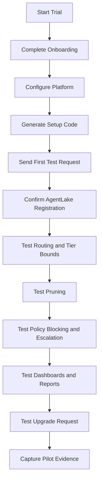

# CostPilot Pilot Readiness Test Guide

This guide is for testing CostPilot before sharing it with a pilot customer or business partner.

The goal is simple: confirm that the full customer journey works, the core product claims are visible, and the system does not confuse the user with missing data, raw IDs, broken filters, or unclear results.

This is written as a hands-on test plan. Each section has:

- What you are testing
- Why it matters
- Steps to perform
- Expected result
- Pass/fail notes

## Pilot Readiness Rule

CostPilot should not be shared with a pilot customer until these core flows pass:

- A new user can start a trial.
- The user can get from trial signup to setup without confusion.
- The user can configure a platform.
- The user can send a first test request.
- The request appears in the dashboard, AgentLake, and audit views.
- Agent names and department names are human-readable.
- Sensitive data blocking works.
- Escalation/routing works.
- Per-agent tier bounds work.
- Context pruning shows token savings when pruning actually occurs.
- Filters stay selected after auto-refresh.
- Reports can be drilled into.
- Savings numbers are explainable and scoped correctly.
- Upgrade request flow is visible.

If any of those fail, the product may still be demoable, but it is not pilot-ready.

## Recommended Test Order

Use this order so each test builds on the one before it.



## Test Environment

Primary pilot environment:

- Trial page: `https://fage-engine-21cb49fe4806.herokuapp.com/trial.html`
- Executive dashboard: `https://fage-engine-21cb49fe4806.herokuapp.com/index.html`
- Operate dashboard: `https://fage-engine-21cb49fe4806.herokuapp.com/operate.html`
- Onboarding: `https://fage-engine-21cb49fe4806.herokuapp.com/onboarding.html`
- Reports: `https://fage-engine-21cb49fe4806.herokuapp.com/reports.html`
- Admin: `https://fage-engine-21cb49fe4806.herokuapp.com/admin.html`

Use an incognito browser window for new-customer testing. That helps avoid cached state from previous sessions.

## Evidence To Capture

For every pilot readiness run, capture screenshots of:

- Trial signup page
- Trial banner showing remaining days and usage
- Onboarding platform selection
- Generated setup code
- Successful first test request
- Governance Event Stream entry
- Expanded audit detail
- AgentLake registered agent
- Per-agent tier setting
- Executive dashboard savings view
- Operate dashboard
- Reports page with drilldown
- Upgrade request flow

Save notes for anything confusing. Confusion is a product issue, even if the code technically works.

## 1. New Customer Trial Signup

### What This Tests

This confirms a first-time user can enter through a trial link and understand that they are starting a 30-day trial.

### Why It Matters

The product promise is plug-and-play. The first screen should not feel like an internal admin tool or a developer-only setup page.

### Steps

1. Open an incognito browser window.
2. Go to `https://fage-engine-21cb49fe4806.herokuapp.com/trial.html`.
3. Start a new trial using a test email address.
4. Continue into the app.
5. Confirm the top trial banner appears.

### Expected Result

- The user can start the trial.
- The app shows trial status.
- The user can continue into onboarding or the workspace.
- The screen should not show unrelated old customer data unless the app intentionally uses shared demo data.

### Pass/Fail Notes

- Pass:
- Fail:
- Notes:

## 2. New Customer Navigation

### What This Tests

This confirms the customer can move through the product without getting trapped on one page.

### Why It Matters

A pilot user should not have to remember hidden URLs. Navigation should support the journey:

trial signup -> setup -> test request -> dashboard -> operate -> reports -> upgrade

### Steps

1. From the app header, go to the executive dashboard.
2. Go to the regular dashboard or operate view.
3. Go to admin.
4. Go back to dashboard without needing to return through the executive dashboard first.
5. Open reports.
6. Return to setup or connect page.

### Expected Result

- Navigation labels are clear.
- Dashboard and executive summary are not confused with each other.
- The user can access operate/admin/reports directly from the header.
- No page returns `Not Found`.

### Pass/Fail Notes

- Pass:
- Fail:
- Notes:

## 3. Platform Setup And Onboarding

### What This Tests

This confirms the onboarding flow supports multiple platforms, not only Salesforce.

### Why It Matters

CostPilot should feel platform-neutral. If the user chooses Salesforce, the language should feel Salesforce-specific. If the user chooses ServiceNow, HubSpot, Python, Node, Java, Ruby, or REST, the instructions should match that platform.

### Steps

1. Open onboarding.
2. Choose Salesforce.
3. Confirm the page uses Salesforce language.
4. Choose a non-Salesforce platform such as ServiceNow, HubSpot, Python, Node, Java, Ruby, or REST.
5. Confirm the setup instructions and generated code change to match the selected platform.
6. Add fields to send to CostPilot.
7. Generate setup code.

### Expected Result

- Platform cards are grouped cleanly.
- Business platforms and code/API platforms are not mixed under the wrong heading.
- Add Field works.
- The generated code uses the selected platform.
- The generated code does not ask the customer to paste an OpenAI key into the code.
- The generated code includes the fields the user selected.

### Pass/Fail Notes

- Pass:
- Fail:
- Notes:

## 4. Field Mapping

### What This Tests

This confirms the user can choose which fields are sent to CostPilot.

### Why It Matters

Customers need flexibility. Salesforce, ServiceNow, HubSpot, and custom applications all have different field names.

### Steps

1. In onboarding, select a platform.
2. Add a standard field.
3. Add a custom field.
4. Add a clear display label for each field.
5. Generate setup code.
6. Inspect the generated code.

### Expected Result

- The user can add multiple fields.
- The generated code includes all selected fields.
- Field names appear exactly as entered.
- The display label appears in the prompt or payload construction.
- The user does not need to regenerate the whole product to add fields later, but a new generated setup snippet may be needed for the current lightweight connector approach.

### Pass/Fail Notes

- Pass:
- Fail:
- Notes:

## 5. Optional Agent And Department Identity

### What This Tests

This confirms each request can carry a human-readable agent name and department.

### Why It Matters

The dashboard should say "Sales Agent" and "Sales", not a long workspace ID or confusing technical string.

### Steps

1. In onboarding or setup code, configure:
   - Agent name: `Sales Agent`
   - Department: `Sales`
2. Send a test request.
3. Open the Governance Event Stream.
4. Open the audit log.
5. Open AgentLake.
6. Open reports.

### Expected Result

- The request displays `Sales Agent`.
- The department displays `Sales`.
- Long workspace IDs do not appear in customer-facing report tables, chart legends, budget lists, or event rows.
- If a technical ID must exist, it should be hidden in detail views or export data, not used as the main label.

### Pass/Fail Notes

- Pass:
- Fail:
- Notes:

## 6. First Test Request

### What This Tests

This confirms the customer can send a safe, simple AI request through CostPilot.

### Why It Matters

This is the first "aha" moment. The user should see that CostPilot received the request, made a routing decision, and logged it.

### Test Payload

```text
Subject:
Password reset request

Description:
The customer cannot reset their password. Please provide a short response explaining the next troubleshooting steps.
```

### Steps

1. Send the payload through the configured platform or test request pane.
2. Open the Governance Event Stream.
3. Expand the event.
4. Open the audit log.
5. Check the executive dashboard.

### Expected Result

- A new event appears.
- The event shows the correct agent and department.
- The event shows the model tier used.
- The event shows a plain-English rationale.
- The event is not blocked.
- The dashboard request count increases.

### Pass/Fail Notes

- Pass:
- Fail:
- Notes:

## 7. Routing Logic

### What This Tests

This confirms CostPilot routes simple requests to cheaper tiers and complex requests to higher tiers.

### Why It Matters

This is the core value of CostPilot: not every AI request needs the most expensive model.

### Routine Payload

```text
Subject:
Password reset help

Description:
The customer forgot their password and needs the standard reset steps. Keep the answer brief.
```

### Complex Payload

```text
Subject:
Renewal package analysis

Description:
The customer is asking for a detailed analysis of a renewal package, including unusual terms, liability exposure, approval risk, and recommended next steps before signature.
```

### Steps

1. Send the routine payload.
2. Confirm it routes to a lower tier such as Scout or Analyst.
3. Send the complex payload.
4. Confirm it routes to a higher tier such as Advisor or Strategist depending on policy.

### Expected Result

- Routine requests do not always use the highest tier.
- Complex requests route higher.
- The rationale explains why the tier was chosen.
- The selected tier matches policy and per-agent bounds.

### Pass/Fail Notes

- Pass:
- Fail:
- Notes:

## 8. Per-Agent Tier Bounds

### What This Tests

This confirms each registered agent can have its own minimum and maximum model tier.

### Why It Matters

Different agents have different risk levels. A Sales quote agent may need at least Analyst. A simple FAQ agent may be allowed to use Scout.

### Steps

1. Open Admin or AgentLake settings.
2. Find `Sales Agent`.
3. Set minimum tier to `Analyst`.
4. Leave maximum tier as `Strategist`.
5. Send a simple request that would normally route to Scout.
6. Check the event stream and audit log.

### Expected Result

- The request does not route to Scout.
- It routes to Analyst or higher.
- The rationale explains that the agent policy bumped the tier up.
- Other agents are not affected unless they share the same policy by design.

### Pass/Fail Notes

- Pass:
- Fail:
- Notes:

## 9. Context Pruning

### What This Tests

This confirms CostPilot strips unnecessary text before the request is sent to the model.

### Why It Matters

Pruning reduces token usage. This can lower cost and remove irrelevant clutter.

### Pruning-Heavy Payload

This payload avoids escalation words so the main thing being tested is pruning, not higher-tier routing.

```text
From: updates@example.com
Sent: Monday, June 15, 2026 8:12 AM
To: service@example.com
Cc: team@example.com
Subject: Password access follow up


Hello,

The customer needs help with account access. They attempted the reset link twice and still cannot sign in.


-----Original Message-----
From: noreply@example.com
Sent: Sunday, June 14, 2026 7:02 PM
To: customer@example.com
Subject: Automatic notification

This message and any attachments are intended only for the named recipient.
This message and any attachments are intended only for the named recipient.
This message and any attachments are intended only for the named recipient.
This message and any attachments are intended only for the named recipient.


-----Original Message-----
From: system@example.com
Sent: Sunday, June 14, 2026 6:59 PM
To: customer@example.com
Subject: System notice


Footer:
Company address
Privacy notice
Subscription notice
Reference number 12345
Reference number 12345
Reference number 12345


Please help the customer regain access with a short and helpful response.
```

### Steps

1. Send the pruning-heavy payload.
2. Open the event detail.
3. Look for pruning information.
4. Open reports or dashboard token-savings components.

### Expected Result

- The event shows raw tokens and clean tokens when pruning occurs.
- It shows tokens saved.
- It shows percent reduction.
- The dashboard token-savings number increases.
- The customer can understand that email headers, whitespace, and repeated boilerplate were removed.

### Pass/Fail Notes

- Pass:
- Fail:
- Notes:

## 10. Sensitive Data Blocking

### What This Tests

This confirms CostPilot can stop a payload before it reaches an AI model.

### Why It Matters

This is a governance and compliance feature. Sensitive data should not be sent downstream.

### Blocking Payload

```text
Payment issue.

The customer provided card details over the phone. They included the card number, CVV, routing number, and bank account number. They want us to process a refund using those details.
```

### Steps

1. Send the blocking payload.
2. Open the Governance Event Stream.
3. Open the audit detail.
4. Check reports.

### Expected Result

- The event is marked blocked.
- The outcome explains that the request was stopped before reaching an AI model.
- The rationale shows matched sensitive terms.
- The blocked count increases in reports.
- The request does not consume model tokens.

### Pass/Fail Notes

- Pass:
- Fail:
- Notes:

## 11. Escalation Terms

### What This Tests

This confirms certain terms can force higher-tier review instead of quietly flagging.

### Why It Matters

Some topics should not be handled by the cheapest model. They may need a more capable model tier.

### Escalation Payload

```text
Subject:
Customer renewal review

Description:
The customer is asking about legal language, NDA obligations, contract exposure, and liability concerns before approving the renewal.
```

### Steps

1. Confirm the terms are configured as escalation terms in policy settings.
2. Send the escalation payload.
3. Open the event detail.

### Expected Result

- The request is not merely quiet-flagged.
- It escalates to the configured higher tier.
- The rationale names the matched terms.
- The audit log explains why the tier was changed.

### Pass/Fail Notes

- Pass:
- Fail:
- Notes:

## 12. Audit Log

### What This Tests

This confirms CostPilot creates a usable record of AI decisions.

### Why It Matters

The audit log is how a company explains what happened later.

### Steps

1. Open the audit log or operate view.
2. Filter by department.
3. Filter by risk.
4. Filter by blocked events.
5. Expand an event.
6. Download the audit file.

### Expected Result

- Filters show matching records.
- Filters do not clear themselves after auto-refresh.
- Expanded details include:
  - Rationale
  - Agent context
  - Budget context
  - Matched keywords
  - Prompt payload preview
  - Usage source, such as provider reported or estimated
- Download works or shows a clear error if unavailable.

### Pass/Fail Notes

- Pass:
- Fail:
- Notes:

## 13. Governance Event Stream

### What This Tests

This confirms the live event feed is useful and stable.

### Why It Matters

This is often the first operational view a user watches during a pilot.

### Steps

1. Open the Governance Event Stream.
2. Send several test requests.
3. Filter by `Routine`.
4. Filter by `Blocked`.
5. Filter by department.
6. Search by keyword.
7. Wait at least 60 seconds.

### Expected Result

- New events appear without a full-page flash.
- Filters keep working after refresh.
- Routine, blocked, escalated, and flagged filters return correct records.
- Times display in 12-hour format.
- Agent and department names are readable.
- No 500 or 503 errors appear in the browser console.

### Pass/Fail Notes

- Pass:
- Fail:
- Notes:

## 14. AgentLake Registry

### What This Tests

This confirms agents register and display clearly.

### Why It Matters

The customer needs to know which AI workers are using CostPilot.

### Steps

1. Send a request from `Sales Agent`.
2. Open AgentLake.
3. Confirm the agent appears.
4. Rename the agent.
5. Change its tier bounds.
6. Archive and restore if needed.
7. Send another request.

### Expected Result

- The agent appears with a readable name.
- The department is readable.
- The platform is readable.
- The status changes to active only while recently processing.
- The card returns to idle after the configured active window.
- Long IDs do not dominate the screen.
- Tier bounds persist.
- Rename persists.

### Pass/Fail Notes

- Pass:
- Fail:
- Notes:

## 15. Department Budgets

### What This Tests

This confirms department caps and utilization are usable.

### Why It Matters

Budget controls are a key management feature. They must be easy to scan and not become a long confusing list.

### Steps

1. Open Admin.
2. Review Department Budgets.
3. Set a cap for one department.
4. Set throttle floor.
5. Save.
6. Send enough requests to create spend.
7. Return to the budget view.

### Expected Result

- Departments are readable.
- Duplicate workspace-prefixed department names do not appear.
- Long budget lists are searchable, filterable, or collapsed enough to remain usable.
- Cap changes persist.
- Budget utilization updates.

### Pass/Fail Notes

- Pass:
- Fail:
- Notes:

## 16. Savings Dashboard

### What This Tests

This confirms executive savings numbers are understandable and scoped correctly.

### Why It Matters

Executives will look at this first. If numbers disagree without explanation, trust drops.

### Steps

1. Open the executive dashboard.
2. Confirm the filter state.
3. Compare:
   - Requests governed
   - Monthly spend
   - Total AI spend avoided
   - Projected annual savings
   - Routing efficiency
4. Apply filters.
5. Compare the filtered numbers to all-workspace numbers.

### Expected Result

- The dashboard clearly says whether it is showing all workspace data or filtered data.
- Projected annual savings is not confused with current month savings.
- Operate and executive dashboard numbers either match or clearly explain different scopes.
- Blocked events are counted where they are supposed to be counted.
- Filters do not reset after auto-refresh.

### Pass/Fail Notes

- Pass:
- Fail:
- Notes:

## 17. Reports

### What This Tests

This confirms reporting is useful after the pilot starts generating events.

### Why It Matters

Reports are how leaders and administrators understand trends, risk, savings, and usage.

### Steps

1. Open reports.
2. Test each tab:
   - Savings
   - Risk & Compliance
   - Departments
   - Bot Efficiency
   - Agent Activity
   - ROI Calculator
3. Click cards, charts, and high-risk items.
4. Export CSV or PDF where available.

### Expected Result

- Each report loads.
- Charts fit the screen.
- Legends use readable department and agent names.
- Risk items can be drilled into.
- Drilldown explains what caused the risk or flag.
- CSV/PDF buttons do not throw errors.

### Pass/Fail Notes

- Pass:
- Fail:
- Notes:

## 18. Report Drilldown

### What This Tests

This confirms a user can click from a summary number into the actual events behind it.

### Why It Matters

A report should not only say "13 high risk." It should let the user see the 13 events and why they were high risk.

### Steps

1. Open Risk & Compliance.
2. Click Total Events.
3. Click Critical.
4. Click High Risk.
5. Click Blocked Requests.
6. Click the risk-level donut chart.
7. Open a detailed event.

### Expected Result

- Clicks open a filtered detail view, modal, drawer, or audit table.
- The detail view shows the matching events.
- The user can see rationale, matched terms, model tier, department, and agent.
- The user can close the detail and return to the report.

### Pass/Fail Notes

- Pass:
- Fail:
- Notes:

## 19. Model Registry And Pricing

### What This Tests

This confirms CostPilot can explain cost estimates.

### Why It Matters

Savings depend on model prices. If pricing is outdated or unclear, the savings story becomes weaker.

### Steps

1. Open the Models page.
2. Confirm model tiers are visible.
3. Confirm prices are visible.
4. Send requests to different tiers.
5. Compare audit cost estimates to model registry prices.

### Expected Result

- Model names are visible.
- Tier labels are clear.
- Prices are visible or editable by an admin.
- Cost estimates use the registry values.
- Audit detail shows whether usage was provider-reported or estimated.

### Pass/Fail Notes

- Pass:
- Fail:
- Notes:

## 20. Usage Source

### What This Tests

This confirms CostPilot tells the user whether token usage came from the AI provider or from an estimate.

### Why It Matters

Provider-reported usage is stronger evidence. Estimated usage is still useful, but the user should know the difference.

### Steps

1. Send a request in simulated mode.
2. Open the audit detail.
3. Look for usage source.
4. If live provider mode is configured, send a live request.
5. Compare usage source labels.

### Expected Result

- Simulated or internally estimated usage is labeled estimated.
- Provider usage is labeled provider reported when the provider returns usage data.
- The UI does not imply exact billing when the number is only estimated.

### Pass/Fail Notes

- Pass:
- Fail:
- Notes:

## 21. Trial Limits

### What This Tests

This confirms the trial experience shows limits and status clearly.

### Why It Matters

The customer should know how much time and usage remains.

### Steps

1. Open the app with a trial workspace.
2. Confirm the trial banner.
3. Send requests.
4. Confirm usage count changes.
5. Click Upgrade Plan.

### Expected Result

- Days remaining are shown.
- Usage is shown.
- Request count is shown.
- Upgrade call-to-action is visible.
- The upgrade path is not hidden.

### Pass/Fail Notes

- Pass:
- Fail:
- Notes:

## 22. Upgrade Request

### What This Tests

This confirms the user can request a paid plan or upgrade conversation.

### Why It Matters

The pilot needs a next step. A successful trial should lead to a purchase motion.

### Steps

1. Click Upgrade Plan.
2. Submit an upgrade request.
3. Confirm success state.

### Expected Result

- The user knows the request was submitted.
- The page does not dead-end.
- The app still works after the request.

### Pass/Fail Notes

- Pass:
- Fail:
- Notes:

## 23. Multi-Platform Test Pack

### What This Tests

This confirms CostPilot can be tested without needing deep access to every external platform.

### Why It Matters

You may know Salesforce best, but pilots may care about ServiceNow, HubSpot, or code-based integrations.

### Suggested Platform Scenarios

Salesforce:

- Case routing
- Agentforce support assistant
- Custom object field mapping

ServiceNow:

- Incident summary
- IT support assistant
- Priority/risk routing

HubSpot:

- Support ticket response
- Sales follow-up helper
- CRM note cleanup

Python/Node/Java/Ruby/REST:

- Direct API call from an internal app
- Backend workflow sends payload to CostPilot
- CostPilot returns routed response and audit metadata

### Expected Result

- Each platform can send:
  - Text payload
  - Agent name
  - Department
  - Source platform
  - Optional record ID
  - Optional return field mapping
- CostPilot logs the event consistently.

### Pass/Fail Notes

- Pass:
- Fail:
- Notes:

## 24. Security And Trust Checks

### What This Tests

This confirms the pilot does not expose avoidable sensitive information.

### Why It Matters

Customers will be nervous about AI, data, and API keys.

### Steps

1. Review onboarding.
2. Review generated setup code.
3. Review audit details.
4. Review exports.
5. Review browser console.

### Expected Result

- The customer is not asked to paste provider API keys into generated client code.
- Sensitive payloads are blocked when policy says they should be blocked.
- Audit data does not expose unnecessary secrets.
- Trial/workspace identity is not confusingly exposed as a customer-facing label.
- Browser console does not show repeated 500/503 errors.

### Pass/Fail Notes

- Pass:
- Fail:
- Notes:

## 25. Performance Smoke Test

### What This Tests

This confirms CostPilot can handle several requests close together.

### Why It Matters

Real customers may have multiple agents sending requests at the same time.

### Steps

1. Send 5 routine requests quickly.
2. Send 5 complex requests quickly.
3. Send 1 blocked request.
4. Watch the event stream.
5. Check the audit log.
6. Check AgentLake active/idle status.

### Expected Result

- Requests complete.
- The UI remains responsive.
- Events appear without missing data.
- Agent status briefly shows active, then returns to idle.
- No repeated server errors appear.

### Pass/Fail Notes

- Pass:
- Fail:
- Notes:

## 26. UI Regression Checks

### What This Tests

This confirms recent fixes did not break working pilot functionality.

### Steps

1. Open every main page.
2. Use filters on dashboard charts.
3. Wait 60 seconds.
4. Confirm filters remain.
5. Open guide mode.
6. Confirm the highlighted component is visible.
7. Resize the browser.
8. Confirm charts still fit.

### Expected Result

- No blank pages.
- No component overlaps.
- No stretched charts.
- No hidden guide content.
- No filter reset after refresh.
- No IDs in customer-facing chart legends or report tables.

### Pass/Fail Notes

- Pass:
- Fail:
- Notes:

## Pilot Go/No-Go Checklist

Before sharing with a pilot customer, confirm:

- Trial signup works.
- Onboarding works.
- Platform setup works.
- Add Field works.
- Generated code includes agent and department identity.
- First test request works.
- AgentLake registers agents.
- Agent tier bounds work.
- Pruning savings show when pruning occurs.
- Blocking works.
- Escalation works.
- Audit log works.
- Audit download works or has a friendly fallback.
- Filters persist after refresh.
- Dashboard metrics are scoped and explained.
- Reports load.
- Report drilldowns work.
- Upgrade request works.
- No raw workspace IDs are visible in key customer-facing views.
- No repeated 500/503 errors appear in normal use.

## What CostPilot Can Do Today

CostPilot can:

- Start a trial journey.
- Help a user configure a platform.
- Generate setup code.
- Route AI requests by policy.
- Apply agent-level tier bounds.
- Prune unnecessary context.
- Block sensitive payloads before they reach an AI model.
- Escalate risky requests.
- Track agents in AgentLake.
- Show budget utilization.
- Show savings and routing efficiency.
- Show governance events.
- Provide audit detail.
- Show reports.
- Support upgrade request flow.

## What CostPilot Should Not Claim Without Qualification

CostPilot should not claim:

- It controls AI requests that do not pass through CostPilot.
- Estimated token counts are the same as provider bills.
- Savings are guaranteed billing reductions unless live provider usage and accurate model pricing are configured.
- Every platform is a full managed package yet, unless that package exists.
- A customer never needs setup work. The better claim is that setup is guided and lightweight.

## Recommended Pilot Script

Use this simple script while testing or demoing:

1. "We start with a trial link."
2. "The customer chooses their platform."
3. "They select the fields they want CostPilot to inspect."
4. "CostPilot generates the setup code."
5. "A request flows through CostPilot before it reaches the AI model."
6. "CostPilot decides whether the request is routine, risky, expensive, or sensitive."
7. "Routine requests can use cheaper models."
8. "Risky requests can escalate."
9. "Sensitive requests can be blocked before reaching any AI model."
10. "Every decision is logged for audit."
11. "Executives can see savings, risk, and usage."
12. "Admins can manage agents, budgets, and policies."

## Final Pilot Decision

Use this table after a full run.

| Area | Status | Notes |
| --- | --- | --- |
| Trial signup |  |  |
| Onboarding |  |  |
| Platform setup |  |  |
| Generated code |  |  |
| Test request |  |  |
| Routing |  |  |
| Tier bounds |  |  |
| Pruning |  |  |
| Blocking |  |  |
| Escalation |  |  |
| AgentLake |  |  |
| Budgets |  |  |
| Dashboard |  |  |
| Reports |  |  |
| Drilldowns |  |  |
| Upgrade |  |  |
| Security/trust |  |  |
| UI stability |  |  |

Decision:

- Ready for pilot:
- Needs fixes before pilot:
- Owner:
- Target date:

