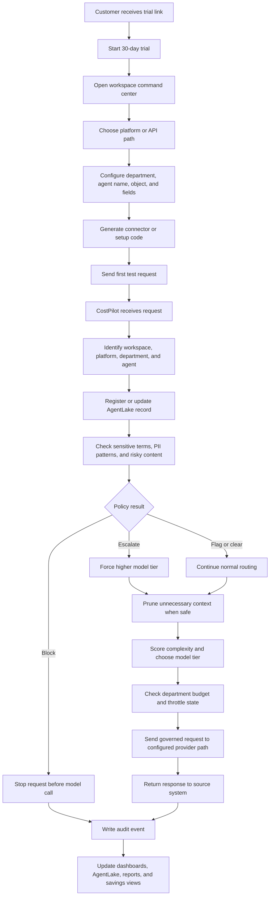

# CostPilot Plain-English Product Guide

This guide explains CostPilot for business partners, pilot customers, executives, and non-technical stakeholders. It describes what CostPilot does, how a request moves through the system, what each screen is for, and where the product's boundaries are.

CostPilot is not an AI model. CostPilot is a control layer that sits between business systems and AI providers. It helps decide what should happen to each AI request before and after that request reaches a model.

---

## 1. Simple Summary

CostPilot helps organizations control AI usage across tools such as Salesforce, ServiceNow, HubSpot, Zendesk, custom apps, and API-based workflows.

It is designed to answer questions like:

- Which team or agent sent this AI request?
- Was the request safe to send to AI?
- Did the request contain sensitive information?
- Could the request be handled by a lower-cost model?
- Did unnecessary text get removed before billing?
- Which department should be charged for the request?
- Did the request create a governance or compliance event?
- How much AI spend did CostPilot help avoid?

In plain terms:

CostPilot acts like a traffic controller for AI requests.

It does not replace Salesforce, ServiceNow, HubSpot, or the AI provider. It helps govern the request path between those systems and the selected model provider.

---

## 2. End-to-End Flow Chart

The chart below shows the normal CostPilot flow from pilot signup to governed AI activity.

---

## 3. What CostPilot Is

CostPilot is an AI cost and governance control layer.

It receives AI requests from business systems, applies rules, routes the request, records what happened, and updates dashboards.

CostPilot focuses on five main outcomes:

1. Cost control
2. Safer AI usage
3. Better visibility
4. Department-level accountability
5. Easier pilot onboarding

### What "control layer" means

Without CostPilot, a business app might send a prompt directly to an AI model. That can make it hard to know:

- Who sent the request
- What department should pay for it
- Whether the content was sensitive
- Whether the best model was selected
- Whether the request was unnecessarily expensive
- Whether the request should be audited

With CostPilot, the request goes through a governed path first.

---

## 4. What CostPilot Is Not

CostPilot is not:

- An AI model by itself
- A replacement for Salesforce, ServiceNow, HubSpot, Zendesk, or another system of record
- A replacement for legal, compliance, or security review
- A guarantee that an AI response is correct
- A guarantee that every sensitive phrase in the world will be caught without configuration
- A tool that controls AI requests that bypass CostPilot

CostPilot can only govern requests that are routed through it.

---

## 5. Pilot and New Customer Flow

This is the intended simple path for a new customer or pilot user.

### Step 1: Customer receives a link

A pilot customer receives a CostPilot link by email or direct message.

Example:

`https://fage-engine-21cb49fe4806.herokuapp.com/trial.html`

The goal is for the customer to start without a long technical setup call.

### Step 2: Customer starts a 30-day trial

The trial flow creates a customer workspace. The workspace is used to separate pilot activity from other activity.

The trial flow can track:

- Trial status
- Trial days remaining
- Workspace ID
- Usage limits
- Upgrade interest

### Step 3: Customer opens the workspace command center

The workspace page is the pilot home base.

It helps the customer:

- See setup progress
- Send a first test request
- Open the dashboard
- Open reports
- Open live operations
- Request an upgrade

### Step 4: Customer chooses a platform path

CostPilot supports multiple platform setup paths.

Business platform examples:

- Salesforce
- ServiceNow
- HubSpot
- Zendesk
- Microsoft/Dynamics-style workflows

Code/API examples:

- Python
- Node.js
- Java
- Ruby
- REST/cURL

The customer should choose the platform that matches the first workflow they want to test.

### Step 5: Customer configures request fields

The customer chooses the object or record type and the fields they want to send to AI.

Salesforce example:

- Object: Case
- Fields: Subject, Description, Priority, Status, Custom_Field__c
- Agent name: SF-CaseBot
- Department: Support

ServiceNow example:

- Table: Incident
- Fields: short_description, description, priority, assignment_group
- Agent name: SN-IncidentBot
- Department: IT

HubSpot example:

- Object: Ticket or Deal
- Properties: subject, content, dealstage, amount
- Agent name: HubSpot-SalesBot
- Department: Sales

### Step 6: CostPilot generates setup code

CostPilot generates code or integration instructions based on the selected platform.

Examples:

- Salesforce Apex and Flow action
- ServiceNow script path
- HubSpot custom workflow code
- Python request snippet
- Node.js request snippet
- Java request snippet
- Ruby request snippet
- REST/cURL request

The generated setup code should send requests to CostPilot instead of directly to the AI provider.

### Step 7: Customer sends the first test request

The first test can happen in two ways:

1. Use the CostPilot workspace test panel.
2. Trigger the workflow from the real source platform.

The test request is important because it proves:

- CostPilot can receive the request
- The agent can appear in AgentLake
- The department can be tracked
- The request can be routed
- The audit log can capture the event
- The dashboard can update

### Step 8: Customer reviews results

After test traffic starts flowing, the customer can review:

- Executive savings dashboard
- Operate/live operations view
- AgentLake registry
- AI decision audit log
- Reports
- Admin configuration
- Model registry

### Step 9: Customer can request upgrade

The upgrade page records interest in moving beyond the pilot/trial.

This does not automatically replace a commercial agreement. It creates a clear path for follow-up.

---

## 6. Request Processing Flow

This section explains what happens when a single AI request reaches CostPilot.

### Step 1: CostPilot receives the request

The request may come from:

- Salesforce
- ServiceNow
- HubSpot
- Zendesk
- A custom web app
- A Python script
- A Node.js application
- A Java application
- A Ruby application
- A REST API call

The request can include:

- Prompt or text
- Platform name
- Department
- Agent name
- Record ID
- Payload type
- Fields from the source system
- Workspace information

### Step 2: CostPilot identifies the request context

CostPilot tries to understand:

- Which workspace sent the request
- Which platform sent the request
- Which agent or bot sent it
- Which department owns it
- Which record or object it relates to

This context powers the dashboard, reports, AgentLake, budgets, and audit log.

### Step 3: AgentLake is updated

AgentLake is the registry of AI agents that are known to CostPilot.

When a request comes in, CostPilot can register or update the agent so users can see:

- Agent name
- Department
- Platform
- Status
- Last active time
- Budget/spend relationship
- Whether pruning is enabled
- Tier bounds
- Archived or active state

Real-life example:

A Salesforce case assistant sends a request. CostPilot records it as "SF-CaseBot" under the Support department instead of showing only a system ID.

### Step 4: Sensitive terms and risky content are checked

CostPilot checks the request for configured sensitive terms and patterns.

Terms can be configured with actions such as:

- Block
- Escalate
- Flag

Examples:

- A blocked term can stop the request before it reaches an AI model.
- An escalation term can force a stronger model tier.
- A flagged term can allow the request but record it for review.

Real-life example:

A support case contains a social security number. CostPilot can block the request before sending it to the AI provider and create an audit event.

### Step 5: Code-like payloads are protected from unsafe pruning

CostPilot has logic to detect code-like text.

Why this matters:

Pruning an email thread is usually safe. Pruning source code, SQL, JSON, or scripts can break meaning.

If a payload looks like code, CostPilot can avoid pruning so the code is not damaged.

Real-life example:

An engineering team sends a SQL query for review. CostPilot should not strip or rewrite syntax as if it were an email thread.

### Step 6: Token pruning removes unnecessary context when safe

When the text is normal prose, CostPilot can remove unnecessary content before the model call.

Examples of content that may be removed:

- Email headers
- Repeated reply chains
- Legal disclaimers
- HTML noise
- Excess whitespace
- Signatures

The goal is to send the useful part of the request while avoiding token waste.

Real-life example:

A Salesforce case includes a long email thread. The customer only needs the latest issue summarized. CostPilot can remove old email headers and repeated signatures before routing.

### Step 7: The request is routed to a model tier

CostPilot decides which tier should handle the request.

Typical tier idea:

- Scout: routine, lower-cost work
- Analyst: moderate work
- Advisor: more complex work
- Strategist: premium/high-complexity work

Tier names can be customized in the Admin area.

Routing can be influenced by:

- Request length
- Complexity keywords
- Escalation terms
- Department policy
- Budget status
- Agent tier bounds
- Payload type

Real-life example:

"Summarize this short support ticket" may route to a lower tier.

"Review this contract language for legal risk" may route to a higher tier.

### Step 8: Department budget rules are checked

Each department can have a budget cap.

CostPilot tracks:

- Department name
- Monthly cap
- Current spend
- Used percentage
- Throttle state
- Override state
- Raw payload logging setting

If a department is at or over its budget, CostPilot can throttle the type of model tier that department can use.

Real-life example:

Marketing hits its monthly AI budget. CostPilot can prevent unnecessary premium model usage until a supervisor changes the cap or grants an override.

### Step 9: The request goes to the configured provider path

If the request is allowed, CostPilot sends the governed request to the configured model/provider path.

CostPilot itself is not the model. It controls the request before the provider call and records what happened after the call.

### Step 10: The response returns to the source system

The response can go back to the calling system or workflow.

Examples:

- Salesforce Flow receives the response and writes it to a field.
- ServiceNow updates an incident work note.
- HubSpot updates a ticket summary.
- A Python script receives a response object.
- A REST client receives JSON.

### Step 11: Audit and dashboards update

After the request is handled, CostPilot updates:

- Audit log
- AgentLake
- Spend totals
- Department budget utilization
- Savings dashboard
- Reports
- Live event stream

---

## 7. Main Product Areas

### 7.1 Trial Page

Purpose:

Start a pilot or trial.

What it helps with:

- Starting a 30-day trial
- Creating a workspace
- Estimating usage
- Registering trial intent
- Moving into setup

Who uses it:

- Pilot customer
- Sales partner
- Founder/demo operator

### 7.2 Getting Started Page

Purpose:

Guide a new customer through early setup.

What it helps with:

- Workspace status
- Trial status
- First-call instructions
- Setup progress

Who uses it:

- New pilot customer
- Technical admin

### 7.3 Workspace Command Center

Purpose:

Give the pilot customer a simple command center after signup.

What it shows:

- Trial status
- Setup progress
- Test request panel
- Spend by department
- Recent calls
- Active agents
- Links to main dashboard, live ops, reports, sandbox, onboarding, and upgrade

Real-life example:

A customer starts the trial and wants to know what to do next. The workspace page gives them one place to test and navigate.

### 7.4 Onboarding and Connect Setup

Purpose:

Help the customer connect their first platform or API path.

What it supports:

- Platform selection
- Department selection
- Agent naming
- Object or record type
- Field/property mapping
- Setup code generation
- Voice Guard setup note

Real-life example:

A Salesforce admin chooses Case, enters Subject and Description fields, names the agent "Support Case Bot", and generates Apex setup code.

### 7.5 Executive Summary Dashboard

Purpose:

Help executives understand value quickly.

What it shows:

- Total AI spend avoided
- Economy routing percentage
- Requests governed
- Context pruning savings
- Projected annual savings
- Cumulative spend versus all-flagship baseline
- Department health
- Help text
- Guide mode

Who uses it:

- CEO
- CFO
- CTO
- Business partner
- Pilot evaluator

Real-life example:

A CFO opens the dashboard and sees whether CostPilot is reducing unnecessary premium model spend.

### 7.6 Operate / Live Operations Page

Purpose:

Monitor live AI governance activity.

What it shows:

- AgentLake registry
- Department budget utilization
- 30-day spend and activity trends
- Governance event stream
- Routing insights
- Audit log
- Agent efficiency rank
- Live status

Who uses it:

- Operations lead
- AI platform admin
- Support operations
- Technical pilot owner

Real-life example:

An operations manager sees that Support Agent is active, a request was routed to Advisor, and the Support budget is still under cap.

### 7.7 Admin Page

Purpose:

Manage budgets, agents, tier names, and operational settings.

What it includes:

- Department Budget Manager
- Searchable/filterable budget table
- Cap setting
- Reset month
- Override/revoke override
- Throttle floor selection
- Raw payload logging toggle
- AgentLake registry
- Register new agent
- Archive/unarchive agents
- Rename agents
- Pruning on/off by agent
- Agent tier bounds
- Agent spend intelligence
- Tier name customization
- Demo reset controls

Who uses it:

- Technical admin
- Pilot owner
- AI governance owner

Real-life example:

An admin notices Marketing is close to its cap and lowers its throttle floor to keep future requests on cheaper tiers.

### 7.8 AgentLake Registry

Purpose:

Show the AI agents that are sending traffic through CostPilot.

What it tracks:

- Agent name
- Display name
- Department
- Platform
- Target record/table
- Status
- Last active
- Pruning setting
- Tier bounds
- Archive state
- Spend activity

What it helps answer:

- Which agents are connected?
- Which agents are active?
- Which department owns an agent?
- Is an agent locked, idle, active, or archived?
- How much spend is tied to the agent?

Real-life example:

Salesforce, ServiceNow, and HubSpot agents all appear in one registry instead of being tracked manually in separate tools.

### 7.9 Department Budget Manager

Purpose:

Control AI spend by department.

What it manages:

- Monthly cap
- Current spend
- Used percentage
- Throttle state
- Override state
- Raw payload logging
- Retention setting

What it can do:

- Show budget utilization
- Apply cap changes
- Reset spend for a simulated new month
- Set throttle floor
- Turn raw payload logging on or off

Real-life example:

Operations has a higher AI budget than Marketing, so each department can have its own cap and throttle behavior.

### 7.10 Policy and Rules

Purpose:

Manage keywords and routing behavior.

What it can control:

- Sensitive terms
- Term category
- Term action
- Complexity keywords
- Token thresholds
- Tier names

Possible term actions:

- Block: stop the request
- Escalate: force higher review/tier
- Flag: log quietly for review

Real-life example:

The company adds "NDA" and "contract" as escalation terms so legal-like requests are handled more carefully.

### 7.11 Model Registry

Purpose:

Show and manage known model options and pricing assumptions.

What it includes:

- Model display name
- Model ID
- Provider
- Tier
- Input cost
- Output cost
- Enabled/disabled state
- Default status
- Known model presets

Important note:

Model prices can change. If pricing is manually configured, someone must keep the registry current. A future production-ready version should support a safer model-price update process.

Real-life example:

An admin disables an expensive model option or updates the cost information used for reporting.

### 7.12 Reports

Purpose:

Give deeper analysis beyond the executive dashboard.

Report areas include:

- Savings
- Risk and compliance
- Departments
- Bot efficiency
- Agent activity
- ROI/savings analysis

What reports help answer:

- Where are savings coming from?
- Which departments use AI most?
- Which agents are expensive?
- Which requests were blocked or escalated?
- Which model tiers are being used?
- What risk events happened over time?

Real-life example:

A CTO reviews agent activity and sees which bots are sending the most requests through higher-cost tiers.

### 7.13 Audit Log

Purpose:

Create a record of AI governance decisions.

What it captures:

- Event type
- Timestamp
- Department
- Agent
- Platform
- Model tier
- Risk level
- Outcome
- Rationale
- Budget context
- Matched keywords
- Prompt preview
- Optional raw payload when configured

Audit event examples:

- Request routed to Scout
- Request escalated to Advisor
- Request blocked by sensitive term policy
- Request involved high-risk keywords
- Agent collision lock
- Budget throttle decision

Real-life example:

A compliance reviewer asks why a request was blocked. The audit detail explains which term matched and what CostPilot did.

### 7.14 Savings Calculator

Purpose:

Estimate possible savings before or during a pilot.

What it can support:

- Usage assumptions
- Model mix assumptions
- Current spend estimate
- Potential savings estimate

Real-life example:

A business partner enters rough AI usage numbers to show a customer how routing and pruning may reduce spend.

### 7.15 Sandbox

Purpose:

Test prompts and policies without relying on a live platform workflow.

What it helps with:

- Trying sample text
- Testing blocked terms
- Testing pruning behavior
- Testing routing behavior
- Demonstrating policy behavior

Real-life example:

Before connecting Salesforce, a pilot user pastes a support email into the sandbox to see how CostPilot handles it.

### 7.16 Live Demo / Demo CRM

Purpose:

Demonstrate CostPilot using sample business scenarios.

What it helps with:

- Showing a realistic customer case
- Triggering routing behavior
- Demonstrating dashboards
- Showing audit activity
- Demonstrating how the system behaves with no customer setup

Real-life example:

A partner uses the demo CRM page during a meeting to show how a support case would flow through CostPilot.

### 7.17 Voice Guard

Purpose:

Process call transcripts before AI use.

What it can do:

- Receive a transcript
- Redact or detect sensitive content
- Track redaction events
- Show voice-related stats/events

Current practical use:

Voice Guard is available as an endpoint path for transcript processing. It is a governance feature for text coming from calls.

Real-life example:

A contact center sends a post-call transcript to CostPilot before it is summarized by AI.

### 7.18 Upgrade Flow

Purpose:

Let a pilot customer request a plan upgrade.

What it captures:

- Workspace
- Requested plan
- Contact information
- Upgrade interest

Real-life example:

After testing CostPilot for a week, a customer requests to move from pilot mode to a paid plan conversation.

### 7.19 Guide Mode and Help Text

Purpose:

Help users understand what they are seeing without needing a separate training session.

What it does:

- Shows guided explanations for dashboard areas
- Helps users learn the Executive Summary
- Helps users understand AgentLake, budget bars, audit logs, and reports
- Makes the product easier for executives and first-time users to navigate

Real-life example:

A business partner opens the dashboard for the first time and uses Guide mode to understand what "routing efficiency" and "requests governed" mean.

### 7.20 OpenAI-Compatible Proxy Paths

Purpose:

Let developers send AI-style requests through CostPilot using a familiar API shape.

What it helps with:

- Workspace-specific proxy calls
- Chat-style request forwarding
- Message-style request forwarding
- Trial/workspace separation
- Routing through CostPilot before reaching the provider path

Plain-English explanation:

Instead of a developer calling an AI provider directly, the developer can point the application at a CostPilot workspace endpoint. CostPilot then applies governance and routing before the provider call.

Real-life example:

A Node.js app already knows how to send chat-completion requests. During a pilot, the developer points that app to a CostPilot workspace proxy endpoint so the same type of request can be governed and logged.

### 7.21 Platform Context Enrichment

Purpose:

Add useful business context from a source platform before or during the AI request flow.

What it is for:

- Connecting source-platform record context
- Helping CostPilot understand the business object involved
- Supporting richer Salesforce-style scenarios

Real-life example:

A Salesforce case request may include the case text plus extra record context. CostPilot can use that context to make the audit trail and routing decision easier to understand.

---

## 8. Real-Life Use Cases

### Use Case 1: Salesforce Support Case Summary

Situation:

A support agent updates a Salesforce Case. The case has a subject, description, and long customer message.

Flow:

1. Salesforce Flow sends selected fields to CostPilot.
2. CostPilot identifies the agent as a Salesforce support agent.
3. The Support department is assigned to the request.
4. CostPilot checks sensitive terms.
5. The pruner removes email thread noise if safe.
6. The router chooses the model tier.
7. The response returns to Salesforce.
8. The audit log records the decision.

What the customer sees:

- The agent appears in AgentLake.
- The Support budget updates.
- The audit log shows the route decision.
- The dashboard counts the governed request.

### Use Case 2: ServiceNow Incident Triage

Situation:

An IT incident needs a short summary and priority recommendation.

Flow:

1. ServiceNow sends incident fields to CostPilot.
2. CostPilot identifies the platform as ServiceNow and the department as IT or Operations.
3. The text is checked for sensitive data.
4. If routine, the request can route to a lower-cost model tier.
5. The result returns to the workflow.

Value:

Routine IT summarization does not always need the premium model tier.

### Use Case 3: HubSpot Sales Email Draft

Situation:

A salesperson wants help drafting a follow-up email from a CRM record.

Flow:

1. HubSpot sends deal/customer properties to CostPilot.
2. CostPilot identifies Sales as the department.
3. The request is checked for risky terms.
4. The router chooses a tier based on the prompt complexity.
5. The response returns to the workflow.

Value:

Sales leadership can see how much AI activity Sales is generating and what it costs.

### Use Case 4: Legal or Contract Escalation

Situation:

A prompt includes words such as "NDA", "contract", or "liability".

Flow:

1. CostPilot detects configured escalation terms.
2. The request is not treated as routine.
3. CostPilot routes it to a higher tier or records the escalation, depending on policy.
4. The audit log captures the rationale.

Value:

Potentially sensitive legal work receives more careful handling.

### Use Case 5: PII Block Before AI

Situation:

A support case includes protected personal data.

Flow:

1. CostPilot detects a blocked term or PII pattern.
2. The request is stopped before reaching the model provider.
3. An audit event is created.
4. The user sees that the request was blocked.

Value:

Sensitive information can be prevented from entering the AI provider path.

### Use Case 6: Engineering Code Request

Situation:

An engineer sends a SQL query, stack trace, or code block for AI review.

Flow:

1. CostPilot detects code-like content.
2. The pruner avoids stripping important syntax.
3. The router chooses a model tier based on complexity.
4. The audit log notes the decision.

Value:

CostPilot avoids treating code like an email thread.

### Use Case 7: Executive Savings Review

Situation:

A CFO wants to know whether CostPilot is helping.

Flow:

1. The CFO opens the Executive Summary dashboard.
2. They review spend avoided, routing efficiency, requests governed, and projected annual savings.
3. They can drill into reports for details.

Value:

Leadership gets a high-level view without reading raw logs.

---

## 9. What CostPilot Can Do

CostPilot can:

- Receive AI requests from multiple platform and API paths
- Route requests based on complexity and policy
- Track agent, platform, and department context
- Register agents in AgentLake
- Rename and archive agents
- Track active/recent agent status
- Manage department budgets
- Apply budget throttling behavior
- Turn pruning on or off by agent
- Set agent model tier bounds
- Prune unnecessary context when safe
- Avoid pruning code-like payloads
- Block, escalate, or flag configured sensitive terms
- Log routing and governance decisions
- Track usage and cost data
- Show executive savings dashboards
- Show live operational activity
- Show reports by savings, risk, department, bot efficiency, and agent activity
- Support a trial/workspace flow
- Generate platform setup code
- Provide a sandbox/testing path
- Provide a demo CRM path
- Process transcript text through Voice Guard endpoints
- Capture upgrade requests

---

## 10. What CostPilot Cannot Do

CostPilot cannot:

- Govern requests that do not route through CostPilot
- Guarantee every AI answer is correct
- Guarantee every possible sensitive phrase is detected without configuration
- Replace human review for legal, compliance, HR, or security matters
- Replace the customer's CRM, support platform, or AI provider
- Automatically know every customer's internal policy without setup
- Fix inaccurate source data from the sending platform
- Avoid all model costs if the request is allowed to reach a provider
- Maintain accurate model pricing forever without an update process
- Prove production readiness for every platform path until that path is tested end-to-end

---

## 11. Who Uses Each Area

| Area | Primary user | Plain-English purpose |
| --- | --- | --- |
| Trial | New customer | Start the pilot |
| Getting Started | New customer/admin | Understand first setup steps |
| Workspace | Pilot customer | Command center for setup and testing |
| Onboarding | Admin or platform owner | Configure platform fields and generate setup code |
| Executive Summary | CEO, CFO, CTO | See savings and governance results |
| Operate | Operations/AI admin | Monitor live activity |
| Admin | Technical owner | Manage budgets, agents, and controls |
| Policy and Rules | Governance owner | Configure sensitive terms and routing rules |
| Models | AI/platform owner | Manage model registry and costs |
| Reports | Executives/compliance/admins | Review trends and evidence |
| Sandbox | Admin/sales/demo user | Test prompts and behavior |
| Demo CRM | Sales/demo user | Show a working scenario |
| Savings Calculator | Sales/CFO/pilot buyer | Estimate possible value |
| Upgrade | Pilot customer | Request next step after trial |

---

## 12. Example Customer Journey

This is a simple first-week pilot journey.

### Day 1: Start

The customer receives a trial link and creates a workspace.

They open the workspace command center and choose Salesforce as the first platform.

### Day 1: Configure

They choose:

- Object: Case
- Department: Support
- Agent name: Salesforce Support Agent
- Fields: Subject, Description, Priority

CostPilot generates setup code.

### Day 1: Test

They send one test request through the workspace test panel.

They confirm:

- A request was governed
- An agent appeared
- The dashboard updated
- The audit log created a record

### Day 2: Real platform test

They paste or install the generated code into the platform workflow.

A real record change triggers a request through CostPilot.

### Day 3: Review

The pilot owner reviews:

- AgentLake
- Budget utilization
- Audit log
- Executive savings dashboard
- Reports

### Day 4-5: Add another workflow

They add a second platform or another department.

Example:

- ServiceNow Incident Bot
- HubSpot Sales Bot
- Zendesk Support Bot

### End of pilot review

The team decides whether the pilot showed enough value to request an upgrade or continue testing.

---

## 13. Plain-English Glossary

### Agent

An AI caller or bot that sends requests through CostPilot.

Example: "SF-CaseBot" or "ServiceNow Incident Bot".

### AgentLake

The registry where CostPilot shows connected agents, their status, their departments, and their activity.

### Audit log

A record of what CostPilot did with each important request.

### Budget cap

The spending limit assigned to a department.

### Department

The business group responsible for a request, such as Support, Sales, Marketing, Operations, or Engineering.

### Escalation

When CostPilot decides a request should receive more careful handling or a higher model tier.

### Model tier

A category of AI model cost/capability. Lower tiers are usually cheaper. Higher tiers are usually reserved for more complex work.

### Pruning

Removing unnecessary text from a request before sending it to the AI provider.

### Routing

Choosing how a request should be handled and which model tier should be used.

### Sensitive term

A word or phrase configured as risky, such as legal, health, financial, HR, or custom company terms.

### Throttling

Limiting model usage when a department is near or over budget.

### Workspace

A customer or pilot environment used to track that customer's trial activity.

---

## 14. Summary

CostPilot is built to make AI usage easier to start, easier to control, and easier to explain.

For a new pilot customer, the intended experience is:

1. Start a trial from a link.
2. Choose a platform.
3. Configure fields, department, and agent name.
4. Generate setup code.
5. Send a first request.
6. See the result in dashboards, reports, AgentLake, and the audit log.
7. Decide whether to expand or upgrade.

CostPilot's main value is not that it creates AI responses by itself. Its value is that it helps organizations govern, route, track, and explain AI usage across the systems they already use.
